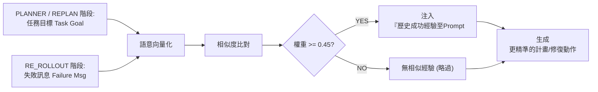

# 20260616 研究進度報告

## 一、本週核心結論

- 目前成功率不足的主因，不只是 LLM 隨機性，而是 planner 產生的資料流與步驟語意不夠穩定，導致 rerollout 後續很難有效修復。
- rerollout lesson 不適合作為主要經驗來源，因為它依賴 benchmark evaluator 判斷是否成功；比較適合作為實驗分析資料，而不是正式 agent 可使用的在線學習機制。
- 本週主線改為：從 train successful trajectory 萃取更細的 atomic experience，並補強 planner / retry planner / recovery 對 target set、dependency context 與 failure evidence 的使用。

## 二、近期觀察到的主要失敗型態

從 48 tasks、16 tasks v1 與 selected 3 scenarios 回看，失敗多半不是 API 完全無法呼叫，而是中間資料沒有被穩定保存、限制或正確使用。

### 已出現改善

| 類型 | 白話說明 | 目前觀察 |
|---|---|---|
| target set 不完整 / batch 漏處理 | 任務要求處理全部項目，但只處理到部分項目。 | selected 3 scenarios 中已有初步改善，`8749218` 三題由 0/3 變成 3/3。 |
| process / API step 分工錯 | 外部狀態改變被寫成 process step，rerollout 只能局部硬補，容易越修越亂。 | `8749218` 中有改善跡象，近期修改讓 planner 較能保留外部操作為 API step。 |

### 尚未穩定解決

| 類型 | 白話說明 | 目前觀察 |
|---|---|---|
| target set 被擴大 | 原本只該操作指定來源中的對象，但 search 結果混入其他相似對象。 | 仍常出現在 Venmo friend reset 類任務。 |
| step purpose 不清楚 | planner 沒說清楚某步驟要產生什麼資料、給誰用，導致下游拿錯資料。 | 仍需要更明確的 step context。 |
| recovery 修錯方向 | rerollout 找到 API，但 API selection 或 parameter extraction 仍沒有對準原始失敗。 | `3d9a636_3` 中 recovery 想修 `remove_friend`，但實際又選到 `search_users` / `search_friends`，最後 retry exceeded。 |
| raw data fallback | 前面 process step 已產出目標，但 write API 又回頭從原始資料抓候選，造成誤操作。 | 尚未在最新架構中充分驗證，後續需用 `90adc3f_2` 類任務觀察。 |

核心觀察：

```text
planner 若一開始沒有定義清楚「目標集合、資料來源、步驟用途」，
後面的 executor、rerollout、lesson 即使有能力，也很難穩定補回正確任務語意。
```

## 三、本週方法調整

### 1. 從舊版 Lesson 調整為結構化 Atomic Experience

修改動機：

- 老師建議可嘗試把 train dataset 經驗拆得更細，讓 rerollout 也能參考。
- test-time rerollout lesson 的正確性難以在一般 agent 情境中確認，因此目前先不作為主要 RAG 來源。
- 希望先把 train-derived experience 結構化，作為後續產生 step 限制、中間產物提示與 dependency grounding 的基礎，讓 planner 未來能產生更清楚的 step context。
- 同時希望 rerollout / replan 在失敗時能參考更明確的經驗欄位，較容易判斷錯誤發生在哪個資料流或操作限制上。
- 主要想改善的問題類型包含：target set 被擴大、target set 不完整 / batch 漏處理、step purpose 不清楚，以及 process / API step 分工錯。

本週不是從「非 atomic」改成「atomic」，而是把原本較扁平的 atomic lesson 改成更容易檢索、注入與檢查的結構化格式。目標是保留可重用原則，同時讓不同階段更清楚知道它適用於什麼情境、需要哪些中間資訊，以及常見誤用是什麼。

欄位簡述：

- 舊版 lesson：
  - `task_goal`：來源任務目標。
  - `conflict`：當時遇到的問題。
  - `solution`：成功時採用的解法。
  - `lesson`：整理出的經驗原則。
- 結構化 atomic experience：
  - `source_task_goal`：來源任務目標，主要用於檢索與追溯。
  - `when_to_use`：適合參考這條經驗的情境。
  - `core_principle`：經驗的核心原則。
  - `required_intermediate_concepts`：planner 應保留或產出的中間概念。
  - `how_to_apply`：如何套用到當前任務。
  - `pitfalls`：常見誤用或需要避免的方向。

### 2. Atomic Experience 的檢索與注入方式

| 階段 | Query 來源 | 與 experience 哪些欄位比對 | 放入 prompt 的欄位 | 目的 |
|---|---|---|---|---|
| Planner | 原始 task goal | `source_task_goal + when_to_use + core_principle` | `when_to_use`, `core_principle`, `required_intermediate_concepts`, `pitfalls` | 讓初始 plan 先定義清楚資料流與 target set。 |
| Retry Planner | task goal、舊 plan、failed step、error reason | 同 Planner | 同 Planner | 重新規劃時修正原 plan 的結構問題。 |
| Rerollout | failure message | `when_to_use + core_principle + pitfalls` | `when_to_use`, `core_principle`, `required_intermediate_concepts`, `pitfalls` | 判斷目前錯誤是可局部修復，還是應該 replan。 |

目前 atomic experience 是提示與約束方向，不是硬規則。它要發揮作用，仍需要 planner 把經驗具體化到當前任務步驟中。

### 3. 補強 Failure Evidence

只改善 experience 還不夠。若系統看不到「應該處理哪些 target」與「實際處理哪些 target」，就算 API 回 success，也可能漏掉部分任務。

原本與修改後的差異：

| 版本 | analyze_result / rerollout 可看到的資訊 | 影響 |
|---|---|---|
| 原本 | analyze_result 可看到 step goal 與 API call result，但缺少明確的 dependency comparison context；錯誤往上傳時也缺少結構化 evidence。 | API 回 success 時，可能不知道是否漏處理 dependency 中的部分 target。 |
| 修改後 | analyze_result 額外看到 dependency context；失敗時把 analysis reason、dependency context、call experience 整理成 failure evidence 往上傳。 | 可以比較 expected targets 與 actually executed targets，讓錯誤原因更容易被 rerollout 使用。 |

### 4. Planner Step Type 與結構性錯誤處理

本週也補強 planner 規則，重點不是單純區分 step type，而是避免 planner 一開始產生目前 rerollout 架構修不了的複合步驟。

目前架構限制：

- `INSERT` 目前是 insert before，無法把一個錯誤複合步驟拆成「原步驟前半段 + 新步驟 + 原步驟後半段」。
- rerollout 對原始步驟通常採保守修復，不會輕易直接 replace 原步驟，避免破壞原計畫資料流。
- 若原始步驟本身就錯，卻被硬改成 insert，原本錯誤步驟仍會再次執行，容易造成循環或外部狀態污染。

因此 planner 需要盡量做到：

- 每個步驟只描述一個主要動作。
- 會查詢或改變外部 app 狀態的步驟，應是 `Execute API step`。
- 只做資料轉換、過濾、聚合、比較、格式化時，才是 `Process step`。
- 若暫時不知道 exact API，也不應用 process step 假裝完成外部操作。

目前分工：

```text
小型 API / 參數 / 缺前置資訊錯誤：交給 rerollout。
原 plan 步驟本身不可執行或包含多個外部動作：判定為結構性錯誤，直接 replan。
```

## 四、下一步分析重點

- 不再只增加更多 lesson，而是嘗試把結構化 experience 轉成可落地的 step context：例如資料來源、目標集合、中間產物、限制與常見誤用。
- 下一輪可比較兩種做法：完整 step contract，或較輕量的 dependency-grounded next-step rewriting，也就是根據上一個步驟的實際輸出具體化下一步。
- 短期先用 9 題結果確認改善來源與剩餘問題：`8749218` 是否主要受惠於 batch / target coverage 修正；`3d9a636_2`、`3d9a636_3`、`c77c005_1` 是否仍卡在 step context 或 dependency output 使用不穩。


# 20260609 研究進度報告

## 報告重點

- 研究重點轉為分析目前架構未穩定提升成功率的原因。
- Unseen 16 scenarios / 48 tasks 結果尚未優於學長 baseline。
- 主要失敗原因集中在跨步驟資料角色混淆，而非單純 API 選錯。
- 近期修正已提升流程穩定性，但 planner / recovery 的語意傳遞仍待改善。

## 一、Unseen 48 題實驗結果

- 實驗設定：16 個 unseen `test_normal` scenarios，每個 scenario 跑 `_1/_2/_3`，共 48 題。
- 學長：28/48 成功，成功率 58.3%。
- 我們：20/48 成功，成功率 41.7%。
- 交叉比較：兩者皆成功 17 題、兩者皆失敗 17 題、只有我們成功 3 題、只有學長成功 11 題。
- 結論：這組 unseen 任務尚未支持本系統整體優於學長版本。

## 二、主要問題整理

- 失敗不只是 LLM 隨機性，而是集中在幾類架構問題：
  - **資料格式不一致**（已部分處理）：planner 產出的資料格式，和 executor / 後續步驟期待的不一致。
  - **資料用途混淆**（尚未解決）：參考資料、候選資料、目前狀態與真正操作目標被混用。
  - **批次目標漏處理**（尚未處理）：任務要求處理所有符合條件的項目，但 agent 只完成部分。
  - **修復流程不穩**（已部分處理）：rerollout / retry 能讓 API 跑起來，但可能補錯方向或破壞原任務語意。
  - **資源定位錯誤**（尚未處理）：相似的 note、playlist、user 或 email 被誤認成指定目標。
  - **收尾驗證失敗**（尚未處理）：任務接近完成，但 final answer 或 write target 範圍不符合評估要求。
- 核心觀察：系統較擅長修補局部 API 錯誤，但不擅長穩定維持跨步驟資料角色。

## 三、近期完成的修正

- **Process step 輸出格式一致化**：降低 planner 與 executor 對資料格式期待不一致造成的失敗。
- **Rerollout depth / attempts 修正**：避免同一失敗點被無限制修復，達上限後改走 replan。
- **Successful lesson 收錄條件修正**：只有 final eval 通過的任務才收錄成功經驗，避免失敗經驗污染。
- 這些修正改善流程穩定性與經驗收錄正確性，但尚未解決資料角色混淆。

## 四、下一步方向

- 後續方向從 rerollout 細節微調，轉向 planner / recovery 對資料用途與任務限制的傳遞。
- 此方向對應 PMC 的精神：依賴結果產生後，重新具體化下一步，而不是只依靠初始計畫。
- 優先順序：
  1. **步驟語意標註**：標明每一步是在查狀態、找候選、比較資料，或修改狀態。
     ```json
     {
       "step": "Show current Venmo friends",
       "purpose": "retrieve_current_state",
       "main_output": "current_venmo_friends",
       "data_usage_note": "Use as current state for comparison, not as remove targets."
     }
     ```
  2. **執行前步驟具體化**：根據依賴結果改寫下一步，尤其在 write action 前明確 target。
     ```json
     {
       "original_step": "Remove Venmo friends not in phone friend list.",
       "dependency_result": {
         "to_remove": ["david@example.com"]
       },
       "grounded_step": "Remove only david@example.com. Do not remove other current Venmo friends."
     }
     ```
  3. **Write action target check**：在 add / remove / update / delete 前檢查 target 來源，避免誤用 search result 或 raw data。
     ```json
     {
       "action": "venmo.add_friend",
       "target": ["chris@example.com"],
       "target_source": "phone_friend_contacts",
       "check": "Target comes from original phone friend list, not all search_users results."
     }
     ```
<!--   4. **Successful lesson 後續擴充**：待前面機制能產生結構化執行摘要後，再從摘要中抽取資料流經驗，而不是直接把完整 log 丟給 LLM。
     ```json
     {
       "lesson_type": "data_flow_constraint",
       "summary_source": "structured_trajectory_summary",
       "lesson": "Search results should verify existing candidates, not expand the final friend target set.",
       "applies_to": "set comparison tasks with add/remove actions"
     }
     ```
- 現階段優先處理任務執行當下的資料角色混淆，successful lesson 兩層化暫列後續工作。 -->

## 五、暫定結論

- 現階段不宜主張系統已穩定優於學長 baseline。
- 近期修正已改善流程穩定性與經驗收錄正確性。
- 真正限制成功率的核心仍是 planner / recovery 沒有穩定傳遞「步驟目的、資料角色、使用限制」。
- 下一步重點是結合「步驟語意標註」與「執行前步驟具體化」，降低搜尋結果、目前狀態、候選名單與真正操作目標之間的混淆。

<!--
補充資料與細節紀錄

一、Unseen 48 題細節

- difficulty 1 接近學長，但 difficulty 2 / 3 落差較明顯。
- 同 scenario 三個 variant 連續跑，尚未看到 `_2/_3` 穩定受益於前面任務經驗。
- 我們有少數優勢 scenario，例如 `634f342`：我們 2/3、學長 0/3。
- 明顯落後 scenario 包含 `325d6ec`、`3d9a636`、`0de03ea`：學長 3/3，我們 1/3。
- 資料來源：
  - 學長結果：thesis_notes/formal_test_normal_report.xlsx - formal_test_normal_report.csv
  - 我們結果：tmp/test_global_plan_local_recovery_unseen_16_scenarios_48_tasks_v1
  - 整理文件：thesis_notes/unseen_16_scenarios_48_comparison.md

二、主要問題細節

- 資料格式前後不一致：
  planner 要某一步產出一種資料，但 executor 端實際只接受另一種格式。
- 資料用途被誤解：
  前面查到的資料，後面可能被誤當成操作目標。
- 只處理到部分資料：
  任務要求處理所有符合條件的項目，但 agent 只完成其中幾筆。
- 修復流程失控或修錯方向：
  rerollout / retry 可能一直補同一個失敗點，或插入能讓 API 執行但改壞任務語意的步驟。
- 把錯誤資源當成正確目標：
  例如把相似名稱的 playlist、note、user、email 誤認成正確目標。
- 收尾驗證不符合評估要求：
  這是 near-miss 類錯誤，上層共同點是任務接近完成但最後一兩個評估條件沒過。
  需要再拆成兩種：
  - final answer protocol 錯，例如 `024c982_2` 已成功建立 Venmo request，但最後回傳 request id，評估期待 `null`。
  - write target scope / cardinality 錯，例如 `31dc501_1` 正確更新 wake up alarm，但同時更新了其他 weekday alarms，評估期待只更新 1 個 alarm。

三、代表案例：3d9a636

- 任務本質：讓 Venmo friends 和 phone contacts 中 relationship=friend 的集合一致。
- 理想流程：
  source_set = phone contacts whose relationship includes friend
  current_set = current Venmo friends
  to_add = source_set - current_set
  to_remove = current_set - source_set
- 失敗點：
  - search_users / search_friends 的結果可能被直接拿去 add / remove。
  - search 原本可能只是為了確認候選，卻被誤用成最終操作目標。
  - recovery 插入的新查詢步驟可能讓 API 能跑，但改變原本步驟的資料來源與語意。

四、近期修正實作細節

- planner / retry planner prompt 加入 Process Output Data Contract。
- executor_graph.py 新增 validate_process_output_contract。
- recovery chain depth 修正 shifted original step 的追蹤。
- executor 不再用 child graph 空 attempts 覆蓋 main graph attempts。
- end_task 解析 eval report，check_if_should_extract 只有 eval_passed 才抽 successful lesson。
- v12 初步未再看到 v11 那種 chain depth 3、4 的失控現象。
- v12 `_1` 失敗後沒有產生 successful lesson，避免失敗經驗污染。

五、下一步方向細節

1. Planner / retry planner 加入步驟語意標註
   - 保留目前 step dependency，不改成嚴格變數依賴，避免容錯率太低。
   - 每個 step 額外標註：步驟目的、主要產出、資料使用說明。
   - 第一版作為 soft guidance，不作為硬性變數綁定。

2. 加入執行前步驟具體化
   - 在某個 step 真正執行前，如果它依賴前面結果，先用 dependency outputs 把該 step 重寫得更具體。
   - 特別是 write action 前，應明確指出真正要操作的 target、target 為何符合任務條件、哪些查詢結果只是輔助資訊。
   - 這對應 PMC supervisor 的概念：不是直接執行原本模糊的步驟，而是在依賴結果出來後重新具體化下一步。

3. Write action 前加入 target sanity check
   - 在 add / remove / update / delete / create 之前，檢查 target 是否來自正確來源集合、是否只是 search result 或 current state、若 target 是 list 是否已處理所有應處理項目。
   - 第一版可先用 prompt-level check，不急著做成硬 validator。

4. 後續擴充 successful lesson
   - 目前 successful lesson 偏向局部 API 修復，例如缺 token 或缺參數。
   - 等 planner 語意標註與執行前具體化穩定後，再讓 lesson 記錄資料流限制，例如 search result 只能驗證候選、current state 只能用來比較、集合型任務應維持 source set/current set/target set 區分。

六、PMC 對應關係

- PMC 的 require_data 對應我們的 depends_on。
- PMC 的 local constraints 可對應 step-level data usage note。
- PMC 的 global constraints 可對應 task-level guidelines。
- PMC 的 supervisor 根據前置 sub-task 結果重寫下一個 sub-task，對應我們的 execution-time step grounding。
- 本研究目前不打算完整改成 PMC multi-agent，而是先吸收「依賴結果出來後重新具體化下一步」的機制。
-->

---

# 20260602
## 摘要

本週主要驗證 rerollout 與 experience 對任務成功率的影響。初步結果顯示，experience 不是單純加入越多越好；若不區分來源與使用階段，反而可能降低成功率。

## 本週想回答的問題

1. 開啟 train dataset 的 global experience 是否能提升成功率？
2. rerollout 產生的 local experience 是否適合直接提供給 planner / replan？

## 實驗設計

目前先看兩層結果：

| 層級 | 用途 |
|---|---|
| 原始 40 題 | 觀察整體成功率變化 |
| 16 題診斷集合 | 從 A/B 結果不同的任務中挑出，用來分析 lesson 影響 |

16 題診斷集合的來源：

- 10 題：A 成功、B 失敗，代表開啟 experience 後退步。
- 6 題：A 失敗、B 成功，代表開啟 experience 後改善。

## 實驗結果

### 原始 40 題整體結果
| 組別 | 設定 | 成功數 | 成功率 |
|---|---|---:|---:|
| 學長 | formal test normal 原結果 | 15/40 | 37.5% |
| A | 不使用 global train lesson，local lesson 全開 | 16/40 | 40.0% |
| B | global lesson + local lesson 全開 | 12/40 | 30.0% |

小結：40 題整體結果顯示，A 組略高於學長但差距不大；B 組低於學長與 A 組，表示 experience 全開目前沒有帶來整體成功率提升，反而可能造成退步。

### 16 題診斷集合結果

| 組別 | 設定 | 成功率 | Weighted pass percentage |
|---|---|---:|---:|
| 學長 | formal test normal 原結果 | 8/16 = 50.0% | 73.7% |
| A | 不使用 global train lesson，local lesson 全開 | 10/16 = 62.5% | 90.0% |
| B | global lesson + local lesson 全開 | 6/16 = 37.5% | 76.8% |
| C | global lesson 開啟，local lesson 只給 recovery | 9/16 = 56.25% | 89.1% |

小結：16 題診斷集合不是用來估計整體成功率，而是用來觀察 lesson 影響；C 組在 10 題 B 組退步案例中救回 3 題，並保住 6 題 B 組改善案例，表示限制 local lesson 只給 recovery 能減少部分負面影響。


## 目前解讀
1. **Experience 全開沒有帶來整體提升。**  
   B 組低於 A 組，也低於學長同批任務結果，表示 global lesson 與 local rerollout lesson 若直接全部提供給 planner / replan，可能造成規劃誤導。

2. **Experience 需要依來源與階段分流。**  
   Global lesson 來自 train dataset 成功案例，內容較偏高層策略，較適合提供給 planner / replan 作為任務規劃參考；local rerollout lesson 來自特定失敗步驟的修復經驗，較適合提供給 recovery 作為局部錯誤修正參考。C 組把 local lesson 限制在 recovery 後，在 10 題 B 組退步案例中救回 3 題，並保住 6 題 B 組改善案例，顯示分流使用比全部直接加入更穩定。

3. **目前不能宣稱 experience 已顯著提升成功率。**  
   C 組仍低於 A 組的 `10/16`，所以目前較保守的結論是：experience 的使用需要分來源、分階段控管，而不是直接全部加入。

4. **Pass percentage 顯示 C 組有不少 near-miss。**  
   C 組整題成功率低於 A，但 weighted pass percentage 接近 A，表示部分失敗任務只差少數測試條件，並非完全偏離任務。

<!-- ## 補充觀察

除了 experience 實驗外，先前也觀察到另一類可能影響成功率的 execution 問題：

> 有些任務在前一個 process step 已經找出需要查詢的目標列表，但下一個 API step 沒有根據該列表產生完整的 API 呼叫次數。

這個問題目前還在尋找合適的驗證方式，尚未形成穩定的實驗方法。初步想確認的方向是：

- 檢查前一步產生的 target list 數量。
- 統計下一步實際 API query 次數與 unique query 數。
- 觀察是否有漏查或重複查詢，並判斷是否導致最終答案不完整。

這部分目前不作為本週主要實驗結論，只先保留為後續需要找方法驗證的問題。 -->

# 論文撰寫大綱
論文題目
A Self-Correction Mechanism for LLM Agents in API Tasks Using Case-Based Learning and Dynamic Plan Repair
基於案例式學習與動態計畫修復之 API 任務大型語言模型代理人自我修正機制研究

### 1. 緒論
- 1.1 研究動機
- 1.2 研究目的
- 1.3 論文架構


### 2. 相關技術與文獻探討
- 2.1 大型語言模型代理人
- 2.2 API任務自動化
- 2.3 案例式學習
- 2.4 動態計畫修復


### 3. 系統方法綜述與架構
- 3.1 基礎架構：APIKGAgent 簡述
- 3.2 本研究問題定義與改良目標
- 3.3 本研究改良架構總覽
- 3.4 成功經驗參考機制
- 3.5 動態修復與局部計畫修正機制
- 3.6 經驗累積閉環

### 4. 系統實作與細節
- 4.1 開發環境與工具
- 4.2 原 APIKGAgent 基礎執行流程與本研究修改點
<!--   - 4.2.1 Main Graph / Executor Graph / API Execute Graph 概述
  - 4.2.2 Process Step / API Step 概述
  - 4.2.3 本研究延伸位置說明 -->
- 4.3 全域成功經驗建立與注入
<!--   - 4.3.1 train dataset 成功經驗萃取
  - 4.3.2 RAG 語意檢索與 Planner 注入 -->
- 4.4 Rerollout 動態修復實作
<!--   - 4.4.1 錯誤分類與修復 API 搜尋
  - 4.4.2 任務步驟的新增、刪除與更新
  - 4.4.3 與原 replan 機制之差異 -->
- 4.5 區域成功修復經驗儲存與檢索
<!--   - 4.5.1 成功修復經驗萃取
  - 4.5.2 Local recovery lessons 儲存與後續任務再利用 -->
- 4.6 其他實作細節

### 5. 實驗與結果分析

- 5.1 研究問題
- 5.2 實驗設置
<!--   - 5.2.1 實驗基準
  - 5.2.2 評估指標
  - 5.2.3 實驗環境 -->
- 5.3 實驗一：整體效能比較
    - 比較本研究完整系統與既有方法在 AppWorld test_normal 上的整體任務完成率。
- 5.4 實驗二：逐步式消融實驗
    - 觀察本研究新增模組對任務完成率的影響。
- 5.5 實驗三：動態修復行為與失敗案例分析
    - 不只看成功率，也分析 rerollout 實際修復了哪些錯誤，以及哪些錯誤仍無法修復。
<!-- - 5.6 延伸實驗：全域與區域經驗拆解（若時間允許） -->

### 6. 結論與未來研究
- 6.1 結論
- 6.2 未來研究


<!-- ## 接下來工作與會議討論重點

1. **確認論文主軸是否可調整。**  
   目前結果不適合主張 experience 明顯提升成功率，較適合改成討論 experience 的來源控管與使用階段控管。

2. **決定下一組實驗優先順序。**  
   若時間允許，優先補 `global only`，用來分離 global train lesson 與 local rerollout lesson 的影響；若時間不足，則先擴大 C 組設定到更多任務，確認 recovery-only 是否穩定。

3. **持續尋找 multi-target query coverage 的驗證方法。**  
   這部分目前先不作為主要消融實驗，等找到較穩定的驗證方式後再決定是否納入正式分析。 -->

<!-- # Agent 研究代辦清單 

## 核心功能開發

### 1. **強化 Planner：產出「任務規格」(The "Test" in TDD)**
- [ ] **修改 Planner 邏輯**：修改 `planner` 的 prompt 或邏輯，使其在規劃階段就能從任務描述中，明確識別並提取出一個結構化的「目標列表 (Target List)」。這份列表就如同 TDD 中的「測試規格」。
- [ ] **定義目標列表結構**：設計一個通用格式來存放目標，例如 `{ "operation": "add_to_playlist", "targets": ["song1", "song2"], "container": "playlist_name" }`。
- [ ] **目標**：將執行期 (executor) 的「逐次猜測 query」行為，提前到規劃期 (planner) 的「一次性精確提取規格」。

### 2. **強化 Executor：執行並「驗證規格」(The "Implementation & Validation" in TDD)**
- [ ] **傳遞目標列表**：讓 `planner` 將產生的「任務規格」(目標列表) 傳遞給 `executor`。
- [ ] **實作批次執行**：`executor` 根據收到的規格，生成剛好能滿足規格的批次化 (batch) API 呼叫。
- [ ] **建立完成狀態追蹤**：在 `executor` 中維護一個 `processed_targets` 列表，用來記錄已成功處理的目標。
- [ ] **開發自我驗證機制**：
    - 在單一 step 結束前，用「初始規格」來驗證「執行結果」。
    - 若有遺漏 (測試未通過)，觸發重試 (retry) 或修正 (correction) 流程，直到所有規格都被滿足為止。
- [ ] **目標**：建立一個可泛化的「規劃 -> 執行 -> 驗證」的自我監督閉環，確保任務的完整性與正確性。

## 實驗與分析

### 3. **既有實驗項目驗證**
- [ ] **驗證 `source_data` 關閉影響**：使用固定的 10 個任務，執行實驗，確認關閉 `source_data` 注入 `process judge` 後的 task-level success rate。
- [ ] **整理失敗案例**：詳細分析上述實驗中的失敗案例，歸納主要原因。

### 4. **新功能成效評估**
- [ ] **擴大測試**：在完成「類 TDD 驗證循環」後，使用同一批 10 個任務（特別是 multi-target 類任務）進行測試，比較改善前後的成功率、API 呼叫次數與效率。

## 學術產出

### 5. **整理論文架構**
- [ ] **建立 `thesis_outline.md`**：開始撰寫論文大綱，將目前的研究動機、挑戰、已嘗試方法、新提出的解決方案（類 TDD 的目標提取與驗證循環）以及實驗規劃，整理成初步的章節架構。
- [ ] **目標**：以論文發表的視角來規劃後續研究，並為下次與老師的會議做好準備。 -->


---

# 20260526

1. **既有內容格式保留問題**
    * **原本想解決什麼**：在 SimpleNote / Spotify 類任務中，planner 或 process step 會先自創格式，導致即使資料查對了，最後輸出格式仍不符合原始內容。
    * **怎麼做**：這週在 planner prompt 與 process judge prompt 中補上較明確的格式保留規則，要求修改既有內容時先觀察原格式，保留 line structure、marker、delimiter、field name、ordering 與 value format，並只替換缺值或 placeholder。
    * **結果怎麼樣**：這個方向有改善原本「自創格式」的問題，但 end-to-end 任務仍未完全解掉；目前看來，主要殘留瓶頸已經不是格式規則本身，而是後續多目標查詢階段的執行邏輯。

2. **`source_data` 注入 process judge 的實驗與回退**
    * **原本想解決什麼**：process judge 以前主要看 `task + step goal + step result`，容易被 step goal 誤導，不一定知道真實來源格式，因此嘗試讓 judge 看到 dependency source context。
    * **怎麼做**：一度將 dependency `source_data` 經過截斷後注入 judge prompt，希望 judge 能根據真實來源資料判斷格式是否正確。
    * **結果怎麼樣**：實驗發現，當 `source_data` 在注入 judge 前被截斷時，如果任務需要對完整資料做精確判斷，例如比對 list membership、position 或數量，judge 可能因為只看到部分資訊而誤判。因此目前先將這條路線改為可控制開關，預設關閉，回到 prompt-only judge 做比較。

3. **多目標查詢任務失敗原因定位**
    * **原本想解決什麼**：在 Spotify 這類需要對多個 target 做查詢的任務中，Agent 常常漏查部分目標，導致最終結果不完整。
    * **怎麼做**：先把 API call cap 提高到 15，並逐步分析 log，確認是 API 本身漏資料、撞到呼叫上限，還是 executor 的控制流程有問題。
    * **結果怎麼樣**：目前已確認問題不在 API 本身，也不在 call cap，而是在 optional `query` 目前仍靠 LLM 一次次猜下一個查詢值。LLM 判斷是否繼續調整參數時，主要依據當前 step goal、memory、API 文件，以及這支 API 在目前 step 內自己的呼叫歷史（call experience），而不是先根據 dependency step 一次展開完整 target list；因此只要它提早回 `null` 或重複 query，流程就可能在還沒覆蓋所有 target 前停止。這表示後續需要往 target-aware batch execution 的方向改，而不是單純再把上限調大。

4. **固定 10 題 preliminary comparison 結果**
    * **結果怎麼樣**：在固定的 10 題 task set 上，保守將 `timeout / aborted` 視為非成功後，目前 task-level success 為 **4/10 = 40%**，與學長提供的同一批 10 題結果相近。


## 下週代辦清單

- **1. 用固定 10 題驗證 `source_data` 關閉後的影響，並整理失敗案例**
- **2. 處理 multi-target query 的 optional parameter 問題**
  - 研究如何讓 query 類 optional parameter 不再由 LLM 逐次猜測。
  - 優先評估是否能根據 dependency step 中已經明確產生的 target list，直接生成較完整的 batch query list。
- **3. 視前述結果決定是否擴大測試**
---

# 20260519
### 論文題目

A Self-Correction Mechanism for LLM Agents in API Tasks Using Case-Based Learning and Dynamic Plan Repair
基於案例式學習與動態計畫修復之 API 任務大型語言模型代理人自我修正機制研究

---

<!-- A Self-Correction Mechanism for API Task Agents Using Case-Based Learning and Dynamic Plan Repair
基於案例式學習與動態計畫修復之 API 任務代理人自我修正機制研究

- Method, Approach, Mechanism
- Self correction 後面通常接什麼

研究不是單一演算法，也不是只提出一個抽象策略，而是設計了一組「代理人在失敗後如何診斷、修復、學習、再利用經驗」的運作流程 >> Mechanism

| 詞彙 | 中文語感 | 適合情況 | 與本研究的符合程度 |
|---|---|---|---|
| Mechanism | 機制 | 強調系統內部如何運作，例如如何觸發、判斷、修復與更新 | 最適合。本研究包含錯誤診斷、局部修復、經驗萃取與經驗復用，較像一組完整的自我修正運作機制 |
| Method | 方法 | 強調一個具體方法、演算法或明確步驟 | 次適合。本研究有具體流程，但不是單一演算法或單一方法 |
| Approach | 途徑 / 方法 / 取向 | 強調整體研究方向或解決問題的策略，語意較寬 | 可用，但較泛，無法明確表現系統內部的診斷、修復與學習流程 |
 -->

<!-- ### 花錢買token查一下方案 -->


### 解決方案與成果

#### 1. 整合 RAG 學習路徑，建立 Replan 可觀測性

*   **問題**: `replan` 的學習來源受限，且其決策過程不透明，無法分析其學習行為。
*   **行動**:
    1.  **整合 RAG 框架**: 將 RAG 深度整合至 `replan`，使其能同時從**全域專家經驗**和**區域動態修復經驗**中進行語意檢索。
    2.  **建立 `TRACE` 日誌**: 在 `replan` 流程中植入追蹤日誌，用以記錄被參考的經驗（來源、相關性分數等）。
*   **效果**:
    *   `replan` 的學習路徑現已完整且完全可觀測，為分析其決策提供了數據基礎。

<!-- #### 2. 提升系統穩健性，減少非預期中斷

*   **問題**: 系統對 LLM 回應的格式要求過於嚴格，有時會因缺少 Markdown 標記而提前終止任務。
*   **行動**: 修正了解析 LLM 回應的邏輯，使其更能容忍格式上的微小差異。
*   **效果**:
    *   顯著減少了因格式問題導致的非預期執行失敗，提升了系統的整體穩定性。 -->

#### 2. 從觀測中發現問題根源：經驗品質不足

*   **問題**: 需要驗證 `replan` 參考經驗後，是否真的產生了「更好」的計畫。
*   **行動**: 透過新建立的 `TRACE` 日誌，對一個觸發了 `replan` 的任務 (`6f4b9a5_2`) 進行深入分析。
*   **效果**:
    *   **發現了錯誤假設**: 觀察到 Agent 因搜尋不到資料，便產生了一個「接受資料找不到」的新計畫。然而，根據任務設計，這些資料理應都能找到。
    *   **定位了根本原因**: 這個「錯誤的假設」暴露了當前**成功經驗的品質不足**。現有經驗沒能教會 Agent 在「搜尋失敗時，應嘗試用不同方式再次搜尋」。
    *   **明確了下一步方向**: 證實了僅打通學習路徑是不夠的。**提升成功經驗的萃取品質**，是下一階段的核心任務。

#### 3. 成功經驗萃取流程重構
*   **升級生成模型：從「總結」到「推理」**
    *   將不再僅僅基於 API 調用順序來生成 `lesson`。
    *   我們會引入一個新的 **Prompt**，並提供包含 `solution.py`、`evaluation.py`等其他證據，引導 LLM 進行深度推理，提煉出更高層次的策略性經驗。

*   **建立智慧篩選機制：從「全收」到「擇優」**
    *   生成後的「候選經驗」將不再直接存入知識庫。
    *   引入一個基於**語義向量 (Embedding)** 的篩選流程。透過計算新經驗與現有知識庫的**相似度**，優先保留「新穎度」高的經驗，並自動**去除**內容重複的條目，確保知識庫的多樣性與價值。

---

## 二、本週待辦清單 (更新版)

#### P0：Replan 經驗使用路徑
- [x] **確認 replan 會使用兩種成功經驗**
  - [x] train dataset 經驗
  - [x] rerollout 成功修復經驗
- [x] **建立 Replan 的可觀測性**
  - [x] 記錄 retrieved lesson 的來源、內容、相似度與檢索模式
- [x] **簡化並確定當前策略**
  - [x] 移除複雜的自動「採納率」判定，回歸人工分析
  - [x] 確定檢索策略：從 `train_dataset` 和 `rerollout` 兩個來源分別檢索 `planner` 和 `recovery` 經驗

#### P0：成功經驗品質標準 (下一步重點)
- [-] **定義高品質成功經驗的標準**
  - [-] 應包含流程順序、隱含條件、決策邏輯，而不僅是 API 操作摘要
- [-] **決定去重與篩選方式**
  - [-] 探索基於文字或 embedding 的相似度去重方法

#### P0：提升成功經驗的產生與管理 (下一步重點)
- [-] **升級 `train_dataset` 經驗產生**
  - [-] 檢查現有 `lessons.jsonl` 的品質，移除重複或低價值經驗
  - [-] 引入更多原始碼 (`solution.py` 等) 作為萃取依據，提升經驗的策略高度
- [-] **升級 `rerollout` 成功經驗管理**
  - [-] 確認 `extractor` 產出的 lesson 能準確反映「從失敗到修復」的過程
  - [-] 加入去重機制，避免累積大量相似的修復經驗

#### P1：後續驗證
- [ ] **比較不同經驗設定下的 Agent 表現**
  - [ ] 無經驗 (Baseline) vs. 舊版經驗 vs. 高品質經驗 vs. 混合經驗
- [ ] **透過日誌分析，觀察經驗對 Agent 行為的影響**
  - [ ] 是否減少了特定類型的重複錯誤？
  - [ ] 是否提升了任務的最終成功率？ 
---

# 20260512
## 論文題目
1. 基於案例學習與動態計畫修復之大型語言模型代理自我修正機制
A Self-Correction Mechanism for LLM Agents Based on Case-Based Learning and Dynamic Plan Repair

1. 大型語言模型代理於工具使用任務中的局部修復與經驗復用機制
Local Repair and Experience Reuse for LLM Agents in Tool-Use Tasks
1. 結合錯誤診斷與局部再展開修復之經驗增強型大型語言模型代理
Experience-Augmented LLM Agents with Error Diagnosis and Local Re-rollout Recovery

## 分鐘級延遲研究
- 完成可觀測化 metrics：
    - LLM API 呼叫量、token 使用量、keyword/API node scoring 數量、per-call latency、search graph 狀態
    - 實驗發現關鍵字數量與最終節點評分量不成正比，故不以關鍵字縮減作為主要降本策略。
- 降低 `Top_N` 以減少 LLM API 呼叫量與延遲暴露風險
    - Top_N: 每一輪僅保留前 N 個最高分的候選 keyword/API node 進入後續評估與規劃的數量
    - 完成 `Top_N=3` 與 `Top_N=2` 的初步比較實驗
    - Top_N=2 可降低約 20–25% 評分成本，但成功率明顯下降
    - 確認降低 `Top_N` 雖然能減少 LLM 評分成本，但會影響任務成功率
- 實驗會盡量安排在早上執行，以降低嚴重延遲發生機率
- 研究重點會回到既有架構優化、論文主線整理，以及 RAG / experience reuse 對任務成功率的實質幫助。

## 目前 train dataset 成功經驗價值太低
- 目前 lessons 從單題 API call sequence 萃取，容易變成登入、pagination、查 detail endpoint 等結構性規則，規則雖然正確，但對 `plan / replan / rerollout` 的幫助有限。
- 主要缺少 train dataset 全觀才能萃取出的經驗，例如：
  - 流程順序：要先做什麼，後面才能做什麼
  - 隱含條件：題目沒明講但可推得的前置條件
  - 易漏限制：題目明講但容易忽略的要求
  - 跨 app / 跨步驟的資訊整合與決策邏輯
- 改進方向: 產生成功經驗時，不只看 API calls、task goal
    - `specs.json`：題目本身，包含原始 instruction、使用者資訊與當前時間。
    - `public_data.json`：題目生成時的公開參數，可用來理解題目條件如何影響流程分支。
    - `ground_truth/solution.py`：標準解法程式，能看出 expert 真正的解題流程、條件判斷與資料處理順序。
    - `ground_truth/evaluation.py`：評分與驗證邏輯，可用來萃取成功條件、易漏限制與格式要求。
- 萃取目標從「API 操作摘要」改成「可被 planner 使用的流程規則」。


## P0：本週先完成

- [x] 可觀測化 metrics
- [x] `Top_N=3` baseline 實驗
- [x] `Top_N=2` 比較實驗
- [x] 整理 `Top_N` 成本控制實驗結論
- [x] 決定不再擴大 `Top_N` 實驗
- [x] 起草論文中英文題目
- [ ] 成功經驗產出與萃取規則優化


<!-- ## P1：成本與流程優化
- [ ] 實作搜尋結果快取
- [ ] 實作 `ConstraintExtractor` 與 `PlanVerifier`
- [ ] 驗證 RAG 實質效益
- [ ] 整理論文主要架構與章節草稿
- [ ] 將 Vertex AI 延遲整理為實驗限制與成本背景
- [ ] 建立正式實驗紀錄模板 -->


<!-- ## 目前進度摘要

本週主要完成 `Top_N` 成本控制實驗，目標是確認是否能在**不明顯降低成功率**的前提下，減少 keyword/API node scoring 造成的大量 Vertex AI API 呼叫。

| 項目 | 狀態 | 說明 |
|---|---:|---|
| 可觀測化 metrics | 已完成 | 已能記錄 `llm_calls`、token、candidate/useful API 數量、latency、search 狀態等 |
| `Top_N=3` baseline | 已完成 | v8、v9、v10 |
| `Top_N=2` 實驗 | 已完成 | v11、v12、v13 |
| 比較分析 | 已完成 | 已比較成功率、API 評分成本、LLM 呼叫量與 Vertex 延遲 |
| 後續策略 | 已收斂 | 不再擴大 `Top_N` 實驗，重點轉回既有架構優化與論文主線整理 |

---

## 實驗動機

這次 `Top_N` 實驗不是主要研究主線，而是因為 Vertex AI API 在實驗過程中出現明顯延遲，甚至有分鐘級、接近 10 分鐘級的 long-tail latency。

因此目前想確認：

> 是否能透過降低 `Top_N`，減少需要被 LLM 評分的 keyword/API 節點數量，進而降低 Vertex AI API 呼叫量與延遲暴露風險，同時盡量維持任務成功率？

---

## Top_N 實驗結果

| 比較項目 | `Top_N=3` | `Top_N=2` | 觀察 |
|---|---:|---:|---|
| strict success | 6/27 = 22.2% | 3/27 = 11.1% | `Top_N=2` 成功率下降 |
| assertion pass rate | 74.4% | 65.9% | 任務品質也下降 |
| LLM calls | baseline | 約下降 23.5% | 呼叫成本降低 |
| batch scoring 量 | baseline | 約下降 25.3% | 節點評分負擔降低 |
| API candidate scoring | baseline | 約下降 24.5% | API 節點評分量降低 |
| token usage | baseline | 約下降 22.5% | token 成本降低 |

---

## Vertex AI 延遲觀察

| 觀察來源 | 結論 |
|---|---|
| `test_vertex_speed*` | 最早發現 Vertex AI 有嚴重延遲與 `429 RESOURCE_EXHAUSTED`，但當時尚未有完整 metrics |
| v3 晚間實驗 | 曾觀察到接近 10 分鐘級延遲 |
| v8-v13 metrics | 後續 metrics 證實部分 LLM call 確實會出現分鐘級 latency |
| v12 早上實驗 | 早上仍可能出現嚴重延遲，表示執行時間不是唯一因素 |

目前判斷，延遲可能同時受到兩類因素影響：

| 因素 | 說明 |
|---|---|
| Vertex-side instability | 例如資源不足、429、long-tail latency，這部分不是程式完全可控 |
| Workload amplification | 任務規劃品質、搜尋節點數、API candidate 數量越多，越容易增加 LLM 呼叫量與延遲暴露機會 |

---

## 目前結論

`Top_N=2` 確實能降低 LLM 評分成本，約可減少 20-25% 左右的 API 呼叫與 token 使用量。

但在目前 9 個任務、每組 3 次重複實驗中，`Top_N=2` 沒有維持與 `Top_N=3` 接近的成功率。因此目前不能說 `Top_N=2` 可以直接取代原本的 `Top_N=3`。

比較合理的解讀是：

> `Top_N=2` 可以作為 low-cost mode，但目前不適合作為預設設定。固定降低 `Top_N` 會減少探索範圍，可能導致必要 API 沒有被保留下來，進而影響任務成功率。

---

## 研究決策

由於目前只剩約一個半月需要整理出論文大致架構，後續不再投入更多時間擴大 `Top_N` 實驗或深入追查 Vertex AI 延遲成因。

後續策略調整如下：

- `Top_N=3` 先維持作為預設設定。
- `Top_N=2` 保留為 low-cost mode 的初步觀察，不繼續大量擴充實驗。
- 後續必要測試盡量安排在早上執行，以降低遇到 Vertex AI server-side long-tail latency 的機率。
- 早上測試不代表可以完全避免延遲，但目前可作為降低風險的實務策略。
- Vertex AI 延遲只作為實驗成本與系統穩定性限制的背景，不作為論文主要貢獻。
- 主要時間轉回既有架構優化、論文主線整理與必要實驗補強。

---

## P0：本週先完成

- [x] 可觀測化 metrics（`keyword_count` / `candidate_api_count` / `latency_seconds` / search metrics 等）
- [x] `Top_N=3` baseline 3 次：v8、v9、v10
- [x] `Top_N=2` 3 次：v11、v12、v13
- [x] 比較分析報告（成功率、`candidate_api_count`、`useful_api_count`、`llm_calls`、token、duration、latency）
- [x] 產出格式化對比表
- [x] 收斂 `Top_N` 實驗結論，決定不再擴大此部分實驗
- [ ] 整理論文主要架構與章節草稿
- [ ] 起草論文中英文題目
- [ ] 將 Vertex AI 延遲整理為實驗限制與成本背景
- [ ] 成功經驗產出與萃取規則優化（每任務上限 2-3、LLM 挑選、簡易去重）
- [ ] 建立正式實驗紀錄模板

## P1：成本與流程優化

- [ ] 實作搜尋結果快取（最小版 in-memory / 本地 json）
- [ ] 修正批次處理：確保 batch 迴圈而非單筆
- [ ] 規劃 adaptive `Top_N` 或 low-cost mode + fallback 策略，暫列為後續工程改善
- [ ] 實作 `ConstraintExtractor` 與 `PlanVerifier`（等 P0 穩定後）
- [ ] 驗證 RAG 實質效益（有 RAG vs 無 RAG） -->


<!-- # 20260511

## 目前進度
- 主要主線是驗證 `Top_N = 2` 能否在**成功率維持差不多**的前提下，降低 `llm api` 呼叫數量
- 可觀測化 metrics 已經完成
- 關鍵字數量上限不等於評分數量上限


## P0：本週先完成
- [x] 可觀測化 metrics（`keyword_count` / `candidate_api_count` / `termination_reason` 等）
- [x] `Top_N` 實驗：baseline 3 次
- [-] `Top_N=2` 3 次
- [ ] 比較分析報告（成功率、`candidate_api_count`、`useful_api_count`、`llm_calls`、`duration`）
- [ ] 起草論文中英文題目
- [ ] 成功經驗產出與萃取規則優化（每任務上限 2-3、LLM 挑選、簡易去重）
- [ ] 建立實驗紀錄模板並產出格式化對比表

## P1：成本與流程優化
- [ ] 實作搜尋結果快取（最小版 in-memory / 本地 json）
- [ ] 修正批次處理：確保 batch 迴圈而非單筆
- [ ] P1：實作 `ConstraintExtractor` 與 `PlanVerifier`（等 P0 穩定後）
- [ ] 驗證 RAG 實質效益（有 RAG vs 無 RAG） -->


<!-- ## 待辦
- [ ] 碩士論文題目2~3個(中英文)
- [ ] 論文摘要?
- [ ] 不限制模型?
- [ ] 搜尋用local模型?
- [ ] 六點跑跑看
- [ ] **針對 API 選擇流程做減量**：確認瓶頸位置並優化。
- [ ] **限制關鍵字索取數量**：降低搜尋成本。
- [ ] **加入成功經驗來輔助篩選**：協助選出更合適的 API。
- [ ] **評估 cache 機制**：降低重複查詢造成的延遲。 -->

# 20260505
<!-- ## 自己的cache
- 速度快，便宜，省token

temperature = 0, seed = 0
把問題query跟LLM回的plan結果，存在cache
一開始已經跑一次了，沒有要動planner或find，其實結果會差不多，前面就只要跑一次，改executor只要載入以前跑的就好 -->

### 目前發現的問題
1. 原rerollout只有更新向前依賴的步驟編號，未更新 jump 編號而出錯
2. **API 選擇流程可能有延遲問題**

### 目前完成的內容
1. **更新重編號邏輯** ✅ 
   - `_fix_internal_refs()` 涵蓋 dependencies_steps、jump_target 和 description 文本。

2. **釐清延遲主因**

#### 效能對比分析表

| 指標 | V3 (Venmo Payment) | V7 (Spotify Song) | 差異倍數 |
|------|------------------|------------------|--------|
| **任務** | 和室友聚餐後，平均分攤車資與餐費，並在 Venmo 上對室友請款、付款給 Nancy | 一直切到下一首，直到遇到一首已下載的歌。|-|
| **總執行時間** | 5181 秒(86.35mins) | 476 秒(7.9mins) | 10.9x |
| **計畫的步驟數** | 11 步 | 7 步 | - |
| **實際執行的步驟數** | 18 次 | 23 次 | - |
| **search_graph 觸發次數** | 26 次 | 8 次 | 3.25x |
| **RE_ROLLOUT 觸發次數** | 6 次 | 2 次 | 3x |
| **平均搜索耗時** | ~200 秒/次 | ~60 秒/次 | 3.3x |
| **平均每步執行** | ~287 秒 | ~21 秒 | 13.7x |
| **429發生次數** | 10 | 0 | 10x |
<!-- | **失敗的步驟編號** | 1, 3, 4, 5, 6, 9 | 1, 6 | - | -->


## 延遲位置分布

| 階段 | V3 | V7 | 主因 |
|------|----|----|------|
| **初期規劃搜索** | ~60 秒 | ~100 秒 | API 篩選 |
| **第 1 次 ROLLOUT** | ~860 秒 | ~150 秒 | 深層搜索 + keyword search |
| **第 2 次 ROLLOUT** | ~860 秒 | ~80 秒 | - |
| **第 3-6 次 ROLLOUT** | ~4400 秒 | - | 累積失敗鏈 |
| **迴圈執行** | ~100 秒 | ~140 秒 | V7 有多次迴圈 |

## 延遲原因總結

**V3 (10.9x 慢的根本原因)**：
- 多次 RE_ROLLOUT 造成累積搜索成本（6 次 × 860 秒）
- Keyword 搜索成本高（每次 ~200 秒）
- 依賴鏈複雜導致多層級失敗（missing roommate → auth 失敗 → cascading errors）

**V7 (相對快速的原因)**：
- 只有 2 次 RE_ROLLOUT，搜索成本低
- 迴圈執行無須搜索（已知 API）
- 依賴清晰，故障快速恢復

## 🛠️ 下階段待辦事項
- **針對 API 選擇流程做減量**：確認瓶頸位置並優化。
- **限制關鍵字索取數量**：降低搜尋成本。
- **加入成功經驗來輔助篩選**：協助選出更合適的 API。
- **評估 cache 機制**：降低重複查詢造成的延遲。


# 20260428
<!-- ### 1. 【核心功能驗證】Token 命名空間隔離
- [x] **實作隔離邏輯**：已完成 `api_execute_graph.py` 修改。
- [x] 監控 `test_cold_start_verify_v2` 運行狀況：穩定執行中（目前推進至 `6f4b9a5_1`）。
- [ ] 驗證 Memory 是否成功區分 `spotify` 與 `simple_note` token：尚待 `6f4b9a5_1` 產出對應 Log 證明（已提前證實 `venmo` / `phone` 隔離正常）。
- [x] 確認 Agent 可由 Memory 自動選取對應 App Token：日誌已確認 `[find_param]` 自動抓取正確前綴 Token 成功。 -->

### 1. **診斷執行變慢原因**
* **背景因素**：[Vertex AI 整合進 Agent Platform](https://www.ithome.com.tw/news/175287)，是導致官方 API 流量管控與「懲罰性排隊」機制變得更加嚴格的主因。
* **發生原因**：在上述嚴格機制下，我們呼叫 API 的頻率與重試速度過快，一旦觸發 429 限制，馬上被官方系統判定為異常惡意流量。
* **造成影響**：請求被強制降級，丟進長達數分鐘的「懲罰性排隊列」，導致速度嚴重卡頓（延遲偶發飆升至 9 分鐘）。
* **舊機制缺陷**：原先遇到報錯時只會「固定等 10 秒然後重新發送」，加上當時採用多線程併發，導致多個失敗的請求會「一起等 10 秒後，在同一瞬間再次發送」，加劇了 Google 對我們惡意攻擊的誤判。
* **解決辦法**：
    1. **單線程與嚴格限流**：限制程式只能單線程發送，並強制規定請求的基礎等待間隔，從根本避免併發造成的驚群效應。
    2. **實作指數退避與隨機抖動**：遇到失敗時，把重試等待的時間以倍數越拉越長（1, 2, 4, 8 秒），並加入零點幾秒的隨機數（Jitter），用溫和且錯開的步調進行重試。
* **目前結果**：透過這些機制，我們成功向伺服器證明程式有實施「主動降載」，目前已順利避開排隊懲罰限制，整體執行速度恢復正常。


<!-- 
### 2. 回應老師回饋
- [ ] **欄位語意統一**：`conflict` 更名為 `challenge`。（待實作）
- [ ] **新增 Trigger 欄位**：包含 `GT 經驗` 與 `Rerollout 經驗` 擴充。（待實作）
- [ ] **內容豐富化**：加入診斷細節形成「成功上下文」。（待實作）

### 3. Distiller & Extractor 升級
- [ ] **修改 distiller.py**：要求提取 Trigger 與戰略意圖。（待實作）
- [ ] **修改 Rerollout 提取邏輯**：封裝並結合前次失敗 Trace。（待實作）

### 4. 新增組件與擴展
- [ ] **實作 `ConstraintExtractor`**：提取硬性約束。（待實作）
- [ ] **擴大專家經驗庫**：增加跨 App 任務數量。（待實作） -->


# 20260421

### 兩種經驗來源的架構
我們目前實作了自動化的學習機制，讓 Agent 具備「事前參考專家」與「事後自我修正」的能力：

#### 做的內容：
1.  **針對性提取先備經驗 (Cold Start)**：
    - **精選領域知識**：目前專門挑選了 **10 個與 Spotify 及 SimpleNote 相關** 的任務進行專家經驗提取。
    - **提供給 LLM 的素材**：
      - **原始目標**：讓模型理解專家的開發意圖。
      - **壓縮後的動作序列**：將數百次 API 呼叫進行 ID 正規化（換成 `{id}`）與重複動作歸併，僅保留參數欄位名稱，去除冗餘數據雜訊。
      
      
      - **反思引導**：要求模型分析「成功背後的規律」而非表面步驟，總結出具備通用性的戰略。


#### 經驗欄位定義
| 欄位名稱 | **先備經驗 (從 Ground Truth)** | **復原經驗 (從失敗中學到的)** |
| :--- | :--- | :--- |
| **Task Goal** | 原始任務目標 | 原始任務目標  |
| **Conflict** | 可能會遇到的挑戰 (例如：需要翻頁) | 實際遇到的報報 (例如：401、參數缺失) |
| **Solution** | 專家的 API 執行路徑 (經壓縮處理) | 證實有效的修復對策 (例如：自動登入) |
| **Lesson** | **「如何做對」的全局策略** | **「如何修復」的戰術指引** |


## 🛠️ 下階段待辦事項
- **驗證 RAG 實質效益**：待現在的這個單一 Scenario 跑完後，對比有無教訓的成功率差異，據此決定是否需要「加碼」專家經驗 (GT) 還是優先修復框架 Bug。
- **解決多 App 認證衝突**：實作 Token 命名空間隔離，防止跨服務任務時 Token 覆寫。
- **診斷「執行變慢」的原因**
- **實作 `ConstraintExtractor`**


# 20260414

### 一、 實作進度與觀察結果

1. **經驗萃取器 (Extractor) 重構**
   將修復經驗由整包 JSON 轉換為「原子化 JSONL」結構儲存，降低檢索雜訊，使雙向 RAG 能更精準地對位報錯資訊。
   - 原RAG: 以「任務 (Task)」為單位，單一任務中所有 Rerollout 成功的修復步驟會被強制綑綁、合併為一筆龐大的經驗，導致後續檢索容易對齊失焦。
   
   - 現RAG: 以「單次修復事件 (Recovery Event)」為單位，每一次獨立的 Rerollout 成功案例皆各自萃取為一筆純淨的經驗。這代表單一複雜任務能拆分出多個獨立且精準的對策，徹底解決雜訊干擾。
   


2. **RAG 檢索架構與對比邏輯重構**
   為解決舊版 RAG 檢索條件錯位（如拿 `task_goal` 去查 `conflict`）及各階段查詢通道混用的情況，實行了兩大關鍵重構：
   - **實作「雙索引語意檢索架構 (Dual-Index RAG)」**：將大腦檢索通道一分為二，做到對症下藥。
     * `Planner Index` 專屬通道：直接用 `task_goal` 與歷史任務目標比對，供高階企劃使用。
     * `Recovery Index` 專屬通道：比對實際發生的 API `conflict` 報錯，供出錯修復時使用。

3. **複雜任務 Log 深度診斷**
   實測觀察顯示，即便 RAG 系統能協助排除 API 層級的執行錯誤，涉及多步驟或模糊條件的複雜任務依然容易失敗。


     

<!-- 3. **RAG 系統執行卡死 (Infinite Loop) 問題追蹤**
   導入 RAG 架構後，發現系統偶爾會發生完全停擺（無限等待）的情況。經診斷程式碼，確認主因為底層調用 LLM ([get_json_from_llm](cci:1://file:///home/t111598049/ntut/api_ai-agent/codes/tools.py:186:0-255:22)) 的錯誤重試機制漏洞所致：
   - **長度超標觸發報錯**：RAG 注入過多歷史經驗至 System Prompt，導致送出的提示詞超過 API (Vertex AI) 長度上限，直接引發 Exception。
   - **重試機制陷入死迴圈**：原例外處理為了對抗網路波動，會在報錯時將嘗試計數扣回 (`retried -= 1`)。但在遇到字數超標這類「重試必定失敗」的場景時，程式持續遭遇「被拒絕 ➡️ 次數退回 ➡️ 睡 10 秒 ➡️ 再次被拒」的無窮迴圈，導致任務卡死無法終止。 -->


### 二、 下階段待辦清單 (Action Items)

- [x] 完成經驗原子化 (JSONL) 重構與 RAG 檢索交叉驗證。
- [ ] 修復 [get_json_from_llm](cci:1://file:///home/t111598049/ntut/api_ai-agent/codes/tools.py:186:0-255:22) 死迴圈漏洞（移除 `retried -= 1`）並提高 JSON 解析格式的容錯率。
- [ ] **實作 ConstraintExtractor 節點**：在 Planner 規劃前，強制解析任務隱含條件，將其轉化為首要的探索型 API 任務。
- [ ] **實作 PlanVerifier (Supervisor) 節點**：於計畫投入執行前進行監督，若偵測到幻覺步驟或約束條件遺漏，即攔截並退回重構。


<!-- # 2026/04/14
## 1. 原本有什麼問題？
* **檢索條件與資料對不齊 (Query Mismatch)**：原本 RAG 系統的查詢邏輯有誤。例如 Planner 階段是拿 `task_goal` 當作關鍵字去查，但語意資料庫裡存的卻是由 `conflict (衝突)` 轉成的向量，兩者猶如雞同鴨講，導致查出來的資料根本不對題。
* **各階段全擠在同一個查詢通道**：不管系統現在是處於高階的「Planner 規劃階段」，還是處於發生報錯的「Rerollout 修復階段」，系統全都是去同一個資料庫（相同的向量物件）撈資料，完全沒有區分戰略跟戰術層級。

## 2. 我做了什麼事？
* **實作「雙索引語意檢索架構 (Dual-Index RAG)」**：將大腦檢索通道徹底一分為二，做到「對症下藥」：
  - `Planner Index` 專屬通道：直接用 `task_goal` 與歷史任務目標比對，專供高階企劃使用。
  - `Recovery Index` 專屬通道：專門比對實際發生的 API `conflict` 報錯，專供出錯修復時使用。
* **實作「知識原子化萃取」**：強制 LLM 進行「一錯一教訓」的拆解，把原本雜糅在一起的大 JSON 包拆成純淨的獨立教訓，存為乾淨的 JSONL 陣列，大幅提升檢索精準度。

## 3. 結果怎麼樣？
* **檢索精準對位**：系統再也沒有發生因為「查錯維度」或跨階段查詢而導致的雜訊干擾，雙大腦路由精確發揮了預期的容錯功用。
* **發現新大陸：無聲邏輯錯誤 (Silent Logic Error)**：深入比對 Log 後發現，即使 API 操作與檢索都完全沒出錯，主流大模型（LLM）在規劃時，仍很容易「主觀漏掉」題目要求的過濾條件（例如漏判斷這筆聯絡人是否隸屬 'friend' 關係），這是導致 Benchmark 任務達標失敗的最深層原因。

---

## 待辦清單

- [x] **完成雙索引 RAG 架構實作**：落實知識萃取優化與雙通道分流，修正舊版 RAG 檢索邏輯對位不準的硬傷。
- [x] **完成階段驗收與 Log 根因分析**：抓出大模型會自我忽略條件約束的邏輯盲點 (Silent Logic Error)。
- [ ] **【下一步】規劃邏輯約束與資料驗證 (PMC/DVR)**：引入事前約束機制 (Constraint Extraction)，在 LLM 產出程式碼前強制確認任務限制，補足模型邏輯漏點。
- [ ] **執行終極消融實驗 (Ablation Study)**：等約束機制實裝後，統一開跑大範圍對比測試（無教訓 vs 硬塞近 5 筆 vs 雙索引 RAG + PMC），用明確的 Token 消耗率與成功率向學界證明架構價值。 -->


---

# 20260407

## 📋 代辦清單
- [x] Vertex AI 遷移與 Thinking Mode 串接
- [x] 實作計畫恢復功能：DELETE 模式
- [x] 核心執行引擎重構：參數同步機制 (Sync Walk)
- [x] 完成步驟編號自動映射與文字 Regex 驗證
- [x] RAG 語意 Lesson 檢索與信心門檻過濾
- [ ] PMC 多重約束規劃

---

## 🛠️ 本階段技術摘要
### 1. 遷移至 Vertex AI 平台與思考模式優化
<!-- - **框架遷移**：全面導入 Vertex AI 模組，並整合動態思維預算 (Thinking Mode) 管理。
- **思維鏈增強**：透過思維鏈 (CoT) 顯著減少了 Agent 在初始規劃階段的邏輯跳躍。 -->
### 2. 進階計畫恢復機制：DELETE 模式
* **錯誤觸發**：當 API 執行失敗，Agent 會立即進入 REROLL_OUT 節點進行故障診斷。
* **自主裁決**：LLM 根據報錯資訊判斷該步驟是否冗餘或邏輯錯誤，並主動下達 DELETE 指令。
* **動態對齊**：系統隨後執行自動化重排策略，物理上刪除該步驟並完成後續編號與引用的無損平移，確保計畫一致性。
### 3. 基於語意向量的 RAG 檢索系統
- **雙向精準召回**：實作 SemanticRetriever 引擎。預防階段對準「任務目標」，修復階段對準「報錯訊息」，實現真正的 Cross-task 經驗傳遞。
- **信心門檻 (0.45 Threshold)**：引入相似度校準機制，自動過濾無關數據，保證經驗注入的高相關性。
- **即時學習閉環**：任務成功後 Lesson 立即轉向量，達成「這一關學，下一關用」的自進化能力。



---

<!-- ## 📊 研究效益總結
* **架構穩定化**：大幅降低格式衝突與異常中斷，顯著提高長週期評測的整體穩定度。
* **復原能力全方位化**：Agent 已完全掌握 INSERT, REPLACE, DELETE 三大修正手段。
* **認知層級進化**：實現從「孤立執行」到「語意導向、經驗驅動」的認知進化，具備基礎的舉一反三能力。
 -->
<!-- --- -->


# 20260331
## 上禮拜回饋回復
### REPLACE / INSERT 判斷時機與程式行為總結
由 RE_ROLLOUT 節點產出操作標籤，決定計畫的局部修正行為：
- **INSERT (插入)**：
  - **判斷時機**：原計畫「首度失敗」時（強制保護），或 LLM 判斷「修復方向正確但仍缺少前提」時。
  - **程式行為**：對 `state["plan_json"]` 呼叫 `.insert()`，讓新修復步驟「插隊」在出錯步驟前。此舉會增加總步驟數，並連帶觸發後續依賴的編號偏移（Offset）。
- **REPLACE (覆寫)**：
  - **判斷時機**：LLM 判斷「現有修復步 API 選錯」，或「修復深度 ≥ 2」時（防止計畫無止盡膨脹）。
  - **程式行為**：直接對錯誤位置使用 `[index] = new` 進行「原地覆寫」。總步驟數與計畫骨架皆維持不變，成功避開不必要的資源搬移與編號重排。

### 為什麼成功經驗必須紀錄成 JSONL 而非 JSON？

1. **極高讀寫效率 (省時省記憶體)**
   JSONL 支援「逐行處理」，累積幾千筆經驗也不會變慢；反觀 JSON 每次寫入都必須把整份檔案載入並重寫，既耗時又吃記憶體。
   
2. **斷電防呆容錯 (防止全毀)**
   JSONL 每行獨立，即使寫到一半當機，也只會損失最後一筆；而 JSON 只要意外少寫一個結尾括號 `]`，整份檔案就會損壞，所有珍貴紀錄將全數報銷。
   **格式比較：**
   ```json
   // ❌ JSON：必須有完整括號，少一個 ] 整份壞掉
   [
     {"lesson": "先登入再操作"},
     {"lesson": "先確認清單再刪除"},
     {"lesson": "寫到一半當機，少了 ]，上面兩筆也全毀！"
    ```
    ```jsonl
    // ✅ JSONL：每行各自獨立
    {"lesson": "先登入再操作"}
    {"lesson": "先確認清單再刪除"}
    {"lesson": "寫到一半當機，只有這行壞掉，上面兩筆完好！"
    ```

## 本周進度

- [x] **1. 改善 Extractor**
  - 導入 `recovery_detail_map` 精準記錄修復細節

  **提示詞欄位對比：**

  舊版：
  - `Question`（任務原始描述）
  - `Final Working Plan`（從冗長計畫中盲猜出錯步驟）
  - `recovery_text`（模糊字串，如 *Step 2 recovered after 1 attempts*）

  新版：
  - `Question`（任務原始描述）
  - `Recovery Details`（每筆故障步驟各含以下欄位）：
    - `Original Step`（精確的出錯步驟描述）
    - `Error Type` + `Failure Feedback`（失敗原因與 API 具體回饋）
    - `Recovery API Used` + `Mode & Attempts`（修復工具、模式與嘗試次數）


- [x] **2. 建立知識防毒機制 (Anti-Poisoning)**
  - **目標**：修改 extractor 節點的 System Prompt。
  - **原因**：防止 LLM 產出「找不到 API 應提早放棄」之類的消極經驗，避免此經驗覆蓋 Planner 原本的「樂觀規劃 (Optimistic Planning)」指導原則。
  - **成果**：已強制 LLM 編寫 Lesson 時「必須導向積極防禦與修正操作」，確保知識庫純淨度。
  


- [x] **3. 驗證與完備同批次學習**
  - **架構優化**：將 Lesson 注入三個規劃節點，確保所有規劃時機都能繼承教訓：
    1. find_useful_api：以 Lesson 作為額外關鍵字，讓 Neo4j 搜出更多可用的 API（如主動挖出 `login`）。
    2. plan_with_apis：規劃時直接參考 Lesson，避免重蹈覆轍。
    3. replan_with_apis：重新規劃時同樣參考 Lesson。
  - **驗證結果**：
    - ✅ `test_32` 中 Task 2 無任何干預下，自動在首步驟排入 `spotify.login`，證實跨任務動態學習成功。
    - 測試量尚少，目前 Lesson 主要集中於登入類錯誤，泛化能力待驗證」


## 下週待辦
- [ ] **4. 完善同批次學習與深層解題邏輯 (RAG / PMC)**
  - **方向 A - 語意知識檢索 (RAG)**：目前注入 Lesson 時只取 JSONL 最後 5 筆（`[-5:]`），當批次任務一多，早期的 Lesson 就會被擠掉而遺忘；且「最近的」不等於「最相關的」，容易引入雜訊。改以語意搜尋，按相似度撈出最相關的 Lesson。
  - **方向 B - 多重約束規劃 (PMC)**：導入「約束條件萃取器 (Constraint Extractor)」，強制 Planner 妥善處理複雜邏輯交集。
- [ ] **5. 緊急基礎建設遷移：全面切換至 Vertex AI API**
  - 因應 Google 突發中止抵免額使用權限，需將後端 LLM 呼叫端點全面遷移至 Vertex AI API 環境。


# 20260324 研究進度報告

## **回顧**

1. **依賴解析強化 (Robust Dependency Parsing)**：
   * 擴展原本 `extract_steps` 的Regex容錯度，確保步驟間數據鏈接。
   * **[本週最新進展]**：目前已進入 **Planner 結構化重構**，徹底改為 **JSON 依賴陣列** 輸出，從根本上取代了脆弱的文字解析方案。

2. **上下文動態隔離 (Dynamic Context Isolation)**：
   * 實作 `keep_dependency` 機制，由系統自主判斷資料繼承權，防止修復步驟（如登入）被前序失敗資料污染。

3. **嵌套與插入機制重構 (Nested INSERT Mechanism)**：
   * 支援 **2 層嵌套修復** 與 **INSERT/REPLACE 模式**。
   * **[關鍵保護]**：原生計畫步驟**強制使用 INSERT 模式**，禁止替換原始邏輯。
   * **[預算管理]**：所有衍生修復行為共享同一個 **原生步驟修復預算**，防範 AI 陷入無窮修補迴圈。


## 本周
## Phase 1：執行韌性強化 (已完成 ✅)

### 核心問題與對策
1. **Token 遺失 (401 循環)**：
   *   **因果**：原先 Token 依賴「顯性鏈結（Using data step X）」。若 Planner 遺漏依賴標註，後續 API 將因拿不到 Token 導致 401 報錯，引發無效的重複登入迴圈。
   *   **解法**：實作 **Memory Token 同步機制**。API 一旦回傳 Token 即「全域廣播」至 Memory，後續步驟若遺漏依賴，執行器會自動從全域狀態補償認證。


2. **解析不穩 (Regex 失敗)**：
   *   **因果**：純文字計畫易因格式微調導致解析中斷。
   *   **解法**：**計畫結構化**，改用 Pydantic JSON 輸出與整數依賴陣列。
- 原

- 現


3. **編號錯位 (多步插入失敗)**：
   *   **因果**：Rerollout 插入多個修復步驟時，固定 +1 的偏移邏輯造成指針指向錯誤。
   *   **解法**：**動態依賴偏移演算法**，依據插入量 (N) 自動校正後續所有依賴。
4. **提前終止 (Planner 悲觀)**：
   *   **因果**：API 搜尋不足導致 Planner 提前放棄。
   *   **解法**：強制 Planner 先排出邏輯主幹，即使工具缺失也要樂觀假設，將 API 補齊的任務延後至 Rerollout 執行期處理。


---

## Phase 2：批次內即時案例學習 (CBL) (進行中 🔄)

### 設計動機
*   **痛點**：前一任務成功修復的教訓（如需要特定 Login）無法傳遞給後續任務，造成重複踩坑。
*   **目標**：透過 **Extractor (萃取)** 與 **Injector (注入)** 實現批次內的知識流動。

### 驗證進度 (Exp 29/30)
| 步驟 | 說明 | 狀態 | 成果重點 |
|------|------|------|----------|
| **Step 1** | 單任務驗證 | **已完成 ✅** | 成功產出 [successful_recovery_experiences.jsonl](cci:7://file:///home/t111598049/ntut/api_ai-agent/appworld_eval/experiments_data/test_always_rerollout_10_tasks_30/successful_recovery_experiences.jsonl:0:0-0:0) |
| **Step 2** | 批次注入測試 | 待執行 | 驗證 Injector 能否讓 Planner 提前預防錯誤 |
| **Step 3** | 全量批次評測 | 待執行 | 對比 Exp 27 Baseline 效能表現 |

### Step 1 實作關鍵突破 (除錯精華)
<!-- *   **欄位一致化**：修正 LLM 輸出的 Key (如 `core_conflict`) 與 Schema (如 `conflict`) 不符的問題，成功打通 Pydantic 驗證。 -->
*   **格式標準化**：確立 **JSONL** 格式（每筆資料一行），解決追加寫入效能與檔案解析問題。
*   **精準萃取機制**：建立了 **「只有經歷過 Rerollout 並順利抵達終點的成功案例」** 才進行萃取的過濾規則，保證了學習庫的高品質，提煉出最具價值的經驗 Lesson。


## 後續計畫
1. 開始 Step 2 注入測試，觀察 Planner 是否因「教訓」而主動優化原始計畫。
2. 進行 Step 3 十任務全量評測，量化 CBL 對成功率的貢獻。


<!-- ### 📋 待辦清單 (To-Do List)

**Phase 1: 結構化重構與穩定性 [已完成] ✅**
- [x] 實作 Memory Token 同步機制，解決 401 循環問題
- [x] 實作 Planner 結構化輸出
- [x] 遷移至結構化依賴陣列，移除正則表達式解析
- [x] 導入樂觀佈局規則，避免提前終止
- [x] 實作強制 INSERT 保護機制，防止原計畫邏輯被覆蓋

**Phase 2: 批次內即時案例學習 (Intra-batch CBL) [進行中] 🔄**
- [x] 定義 [SuccessfulExperience] 資料結構與 Session Memory 儲存機制
- [x] 實作 Experience Extractor：任務成功後自動提煉並儲存恢復經驗
- [x] 實作 Experience Injector：Planner 啟動前將前序成功經驗注入提示詞
- [ ] **Step 1（進行中）**：單一任務驗證，確認 Extractor 產出正確
- [ ] **Step 2**：多任務批次，確認 Injector 正確讀取並注入歷史課程
- [ ] **Step 3（全量）**：10 任務完整批次，對比 Baseline 效能
- [ ] 優化提煉 Prompt，過濾雜訊僅保留最佳解法
- [ ] 升級檢索機制為向量搜尋 (RAG)

---

## 進度

### 全域狀態未同步：關鍵原因與修復

**1. 失效核心原因：**
   - **計畫端**：不會在每個 API 步驟中重複標註登入步驟的依賴，導致後續執行時無法主動讀取已存放的 Token。
   - **後援端**：知識圖譜回溯檢索不夠精準，無法穩定補償計畫中缺失的隱性依賴。

**2. 修復邏輯：**
   - **回歸 Memory 本質**：將 API 回傳的 Token 定義為「全域會話變數」，實現一次登入、全域通用的效果。

### 計畫重構：從文字解析到結構化通訊

- **系統挑戰：** Regex 解析不穩，純文字計畫無法維護步驟依賴的一致性。
- **解決對策：**
  - 全面改用 JSON 結構化輸出，解決解析異常。
  - 實作動態依賴偏移演算法，確保計畫重寫時步驟指針自動對齊。

### 執行韌性增強：樂觀佈局與主幹保護

- **樂觀佈局**：禁止 Planner 因 API 搜尋不足而提前宣告失敗，強制預排邏輯主幹，為 Rerollout 預留空間。
- **強制 INSERT 防護**：強制使用插入式修復模式，防止 AI 誤判導致計畫邏輯被覆蓋。

### Phase 2 實作：批次內即時案例學習

- **設計動機：** 同一批次中，前面任務成功修復的錯誤，後面任務應能直接避免，而非重蹈覆轍。
- **關鍵設計決策：**
  - **「成功」定義**：完成 Rerollout 並到達終止步驟即算成功，不依賴外部評分。
  - **學習範圍**：僅學習「錯誤修正」類型的經驗，避免稀釋錯誤預防的聚焦。
  - **記憶體格式**：每筆經驗包含 goal / conflict / solution / lesson 四個欄位。
 -->


<!-- - planner嚴謹輸出
```json
{
      "step_number": 10,
      "step_type": "Execute API step",
      "description": "If 'refill_amount' from step 9 is greater than 0, refill the Venmo balance using venmo.refill_balance with 'venmo_access_token' from step 7 and 'refill_amount'.",
      "dependencies_steps": [
        7,
        9
      ]
    }
```
- 檢查輸出有沒有符合規格，硬性要求格式(現在有工具)
- openai 會有 schema 帶 body 之類的 -->

# 20260317
* 先:
    * 觀察到機制設計不當
    * 優先解決流程上的問題
* 後： 
    * 再來實作老師建議的「案例學習」部分

## 進度
### 第一階段：修復基礎設施 (Infrastructure Fixes)

*   [x] **修復歷史依賴解析漏洞**
    - 修改 extract_steps，確保 `Using data` 或 `from step X` 等依賴都能正確將變數傳入 Executor。
    - 原錯誤
    **1. 【計畫階段】** Planner (LLM) 產出的指令格式不一，關鍵步驟遺漏了代碼識別所需的括號標記（如：只寫 `from step 5` 而非 [(step 5)](cci:1://file:///home/t111598049/ntut/api_ai-agent/codes/tools.py:494:4-501:35)）。
    
    **2. 【解析階段】** [extract_steps](cci:1://file:///home/t111598049/ntut/api_ai-agent/codes/graphs/main_graph.py:631:0-635:53) 函數的正則表達式過於嚴格，導致其完全無視了指令中沒有括號的依賴編號。
        - 原版的 extract_steps 規定步驟編號必須被括號包圍（如(step 5)）或出現在 Using data (...) 的固定格式中才能被成功識別。
    
    
    **3. 【傳遞階段】** 識別失效使得傳遞給執行端的「記憶上下文」變為真空，徹底切斷了步驟間的數據鏈結。
    
    

    **4. 【執行階段】** API 模組因無法在真空中找到所需的檔案路徑參數，引發 `Parameter Error` 並導致執行中斷。
    - find_param 通過執行 LLM 生成的 Python 腳本，從先前步驟的記憶中提取數據並自動填寫 API 參數。
    
    
    
    
    **5. 【結果階段】** 根源在於依賴映射斷裂，即便多次重試（Rerollout）也無法恢復丟失的數據關聯，最終任務宣告失敗。
    
    - 修改後
    
    

    
*   [x] **實作動態上下文相依性判斷**
    - 重構 _pick_recovery_api_with_llm 的 Prompt，傳入失敗任務的描述文字（Failed Step Text）。
    - 讓 LLM 自主判斷並回傳 `keep_dependency`，決定該救援 API（如 login）是否需繼承前一步驟的背景資料。
    - 成功防堵無關資料污染參數萃取過程（如將長篇清單誤當帳號密碼填入），確保 Rerollout 基礎任務的穩定執行。
    - 原錯誤()
    
    
    
    
    - 修改
    - 
    - 
    - 結果
    
    
*    [x] **重構 Rerollout 嵌套與插入機制**
    - **嵌套修復鏈**：支援最高 2 層的嵌套修復，增強處理連鎖故障（如：登入後又發現缺參數）的能力。
    - **INSERT 模式實作**：新增修復步「插入」機制，可自動補全必要的前置作業（如：自動補做登入）而不遺失原始任務標籤。
    - **依賴連結自動化**：在插入修復步時自動修改後續指令，確保新產出的數據能被正確接力。
    - **預算分配與指標推移優化**：實作跨步驟預算共享機制，精準管理計畫重排 (Renumbering) 時的狀態映射與指標偏移。

<!--     - 原本的執行過程拿不到檔案日期
    - rerollout拿日期，但需要登入(line 2061)
    - rerollout設計上，只能選擇插入一個恢復步驟(第一個插入的修復步驟失敗就直接產出第二個修復步驟取代第一個修復步驟)
    - 但這個問題需要兩個步驟才能修復成功(先登入再拿日期) -->


*   [ ] **解決 Token 與全域狀態未同步問題**
    確保 Rerollout 執行 [login](cci:1://file:///home/t111598049/ntut/api_ai-agent/codes/graphs/main_graph.py:879:0-887:64) 取得新 access_token 時，能寫回並覆蓋全域 `memory` 裡的舊 Token。
    
<!-- *   **[待辦] 優化參數萃取 (find_param) Prompt**
    移除 [api_execute_graph.py](cci:7://file:///home/t111598049/ntut/api_ai-agent/codes/graphs/api_execute_graph.py:0:0-0:0) 中寫死的 `step 7` 範例，讓 LLM 產生的 Python 腳本更泛用、穩定。 -->

<!-- 

### 第二階段：實作 RAG 經驗檢索與反饋 (Teacher's Advice)

*   **[待辦] 收集成功修復經驗 (Data Collection)**
    將 Rerollout 成功的紀錄 (錯誤訊息、當下邏輯、修復參數) 擷取並儲存為本地 JSON/JSONL 檔。
*   **[待辦] 建立語意檢索庫 (Vector DB)**
    撰寫腳本將收集的經驗轉為 Embedding Vector，建置輕量級資料庫 (如 ChromaDB)，並實作加上 API filter 的相似度比對。
*   **[待辦] 整合經驗與更新 Prompt (Integration)**
    修改 Rerollout prompt，加入檢索到的「歷史成功經驗」區塊，並實作三種使用開關 (純 Baseline / 強制參考 / LLM自決)，同時保留 Step-level Context。
*   **[待辦] 產出前自我審查 (Review / Constraint Check)**
    在 LLM 產出修復計畫後，安插 Review 節點，讓 LLM 自我檢視產出是否符合限制條件，不符合則退回。
*   **[待辦] 經驗反饋與修正 (Feedback Loop)**
    實作檢核機制，若參考歷史經驗後仍然失敗，則在資料庫或紀錄中將該經驗標記為「無效 / 不符合」，優化未來的檢索品質。
 -->
<!-- ### 📝 這周除錯與修復進度 

**1. 參數遺失 (Parameter Error) 與資料依賴問題之根源**
* **現象**：系統在執行 `move_file` 等 API 時不斷發生參數遺失；同時在呼叫 [login](cci:1://file:///home/t111598049/ntut/api_ai-agent/codes/graphs/main_graph.py:871:0-879:64) 進行救援時，卻又生出錯誤的大把資料塞進帳密欄位，導致連環失控。
* **原因一：依賴解析死板**。Planner 產生口語化的 `from step X` 時，舊版 [extract_steps](cci:1://file:///home/t111598049/ntut/api_ai-agent/codes/graphs/main_graph.py:631:0-635:53) 無法辨識，導致原本算好的參數沒傳進 Executor (參數遺失)。 
* **原因二：盲目繼承依賴**。Rerollout 插入救援任務（如：登入）時，會強制繼承前一壞掉任務的附帶資料（如：檔案清單），使得參數萃取模組被毫無關聯的大量資料污染。

**2. 解決方案與實作成果**
* **優化歷史依賴解析 ([extract_steps](cci:1://file:///home/t111598049/ntut/api_ai-agent/codes/graphs/main_graph.py:631:0-635:53))**
  * **作法**：將原本僵化的正則表達式改為全域搜尋 `\bstep\s+(\d+)\b`。
  * **成果**：系統現在能精準抓取 LLM 所有口語化的步驟參照，不再漏掉上一步的資料，徹底解決因為依賴流失引發的「無效 Rerollout 死循環」。
* **實作動態上下文相依性判斷 ([_pick_recovery_api_with_llm](cci:1://file:///home/t111598049/ntut/api_ai-agent/codes/graphs/main_graph.py:882:0-909:25))**
  * **作法**：重構 LLM 生成救援計畫的 Prompt，並傳入原本失敗目標。強制 LLM 判斷 `keep_dependency` 來決定是否要將資料帶入該救援 API。
  * **成果**：Agent 現在懂得在執行基礎行為（如登入）時「阻斷不必要的干擾資料」，順利抓取正確帳密並完成自救，大幅提升架構強健度。 -->


<!-- 
### 1. 收集成功修復經驗 (Data Collection)

- 擷取 rerollout 成功的「錯誤訊息、當下邏輯、修復參數...」  
- 將資料寫入本地 JSON / JSONL 檔保存  

---

### 2. 建立語意檢索庫 (RAG & Vector DB)

- 撰寫腳本將收集到的錯誤經驗轉換為 Embedding Vector  
- 建置輕量級向量資料庫（如 ChromaDB）儲存向量與對應文字  
- 實作相似度比對檢索，並加入 filter 條件（如：限定相同 API）  

---

### 3. 經驗應用與 Prompt 更新 (Integration)

- 修改 rerollout prompt template，加入檢索到的「歷史成功經驗」區塊  
- 實作三種經驗使用開關：  
  1. 純 Baseline  
  2. 強制參考  
  3. 讓 LLM 判斷是否採用  
- 實作「Step-level Context」：將前一步驟的錯誤修復紀錄保留到後續步驟參考  

---

### 4. 經驗反饋與修正 (Feedback Loop)

- 實作檢核機制：若參考歷史經驗仍失敗，則紀錄該經驗本次為「不符合 / 無效」，以利後續過濾  

---

### 5. 產出前自我審查 (Review / Constraint Check)

- 在 LLM 產出修復計畫後，安插一個 Review 節點  
- 讓 LLM 自我檢視：「這份產出是否符合任務限制條件？」若否，則退回重做   -->

<!-- ## 系統架構與實驗規劃提案

根據前期的回饋與檢討，主要聚焦於「**導入 RAG 建立錯誤修正經驗庫**」與「**強化 LLM 自我審查機制**」。為因應這些需求，規劃了以下四個主要的系統模組與開發方向：

### 1. 經驗庫的建立與檢索模組 (RAG & Experience Base)
本模組旨在從過往失敗中學習，並將成功的微調/修復策略結構化為未來可用的知識。
* **經驗紀錄 (Record)**：系統化儲存 `rerollout` 成功的經驗（包含：原始 Task、觸發的 Error 機制、當下邏輯、以及最終成功的修正 API/預期參數）。
* **語意分析與向量化 (Embedding Vector)**：將「錯誤訊息 (Error Message)」與「錯誤情境 (Error Logic)」進行 Embedding，存放至向量資料庫。
* **跨任務語意檢索 (Semantic Retrieval)**：在執行不同 Task 卻遇到「類似的錯誤」時，透過向量搜尋（如 Cosine Similarity）調出歷史上相關度最高的成功解除策略。
* **過濾與篩選 (Filter)**：為了確保檢索結果的精度，實作 Filter 機制（例如：優先比對相同 API，或設定 Similarity Threshold）。
* **迭代驗證機制**：如果取出的經驗導入後仍然執行失敗（不符合），則更新該筆紀錄的權重或標註例外，以維持知識庫的最佳品質。

### 2. 經驗應用的三種模式設計 (Experience Application Modes)
為了嚴謹驗證經驗庫所帶來的效益，系統將導入參數化開關，支援三種實驗模式 (Ablation Study)：
1. **模式一：完全不用經驗 (No Experience)**
   純粹依靠 LLM 對當前錯誤訊息的理解進行嘗試，作為對照用的 Baseline。
2. **模式二：強制參考經驗 (Force Experience)**
   只要系統能檢索到相似的 RAG 經驗，就強制注入 Prompt 中作為 LLM 的解題指示。
3. **模式三：LLM 智慧判斷 (LLM Routing/Decide)**
   先將找出的關聯經驗餵給 LLM，由 LLM 評估「這個歷史經驗對解決當前 Bug 是否具備參考價值？」，有幫助才會實際採用。

### 3. Rerollout Template 與 Context 的升級
優化 Prompt Template 結構，並提升單一任務內跨步驟的記憶能力。
* **Prompt 模板擴充**：在 `rerollout` 的框架裡新增專屬區塊 `[Historical Experience]` 或 `[Related Past Fixes]`，專門負責承接 RAG 檢索回來的資料。
* **步驟間的傳承 (Step-level Continuity)**：解決「後續 Step 是否會參考前面步驟的 `rerollout`」的問題。規劃並維護「Session Context」，讓同一個 Task 在發生重複性錯誤（如權限問題）時，能直接參考前幾步的成功解法，避免重蹈覆轍。

### 4. 產出審查與過濾機制 (Self-Reflection & Constraint Review)
透過在執行層加裝攔截機制，進一步節省無效的 API 呼叫次數，並確保計畫精準度。
* **LLM Review 產出**：在 LLM 提出新的 Plan、修正草案或是嘗試呼叫 API 參數後（真實執行前），安插一個 **Review Node (任務監督節點)**。
* **限制與規格審查**：由扮演 Reviewer 的 LLM 負責檢視：**「審查產出是否符合任務限制 (Constraints)？」**、**「傳遞參數格式是否正確？」**。一旦發現不符規範或有潛在邏輯衝突，則直接退回重做。 -->


# 20260224
## 一、增強型錯誤診斷機制：5 種 restart_meta 
針對不同的失敗情境，擷取最適合該情境的現場資訊。

---

### 1. `MISSING_PARAM_GROUP`（相依參數群缺失）
<!-- - **觸發時機**：在填充參數時，LLM 生成的 Python 腳本無法從 Memory 中提取出該 API 規定必須「同時成對出現」的一組參數。
- **Context 意義**：告知分析員這是一整組必填欄位發生缺失。透過提供 current_memory_schema（記憶體的完整結構定義），讓 LLM 能直接透視到底層的資料層級與名稱。
- **JSON 結構**：

```json
{
    "error_code": "MISSING_PARAM_GROUP",
    "details": "Cannot find parameters ['source_file_path', 'destination_file_path'] in previous steps or memory",
    "context": {
        "required_by": "file_system.move_file",
        "current_memory_schema": "{'step 1': [{'source_path': 'str', 'destination_path': 'str'}], 'date_str': 'str'}"
    }
}
``` -->

---

### 2. `MISSING_PARAM`（單一參數缺失）

<!-- - **觸發時機**：在填充單一所需參數時，從 Memory 關聯到 Knowledge Graph 的節點中，都找不到能填補該參數的資料。
- **Context 意義**：告知缺少了某個特定變數。藉由提供 current_memory_schema ，能讓 LLM 發現淺層的拼寫錯誤（如 uid vs user_id）。
- **JSON 結構**：

```json
{
    "error_code": "MISSING_PARAM",
    "details": "cannot find parameter user_id in memory or knowledge graph",
    "context": {
        "required_by": "user_service.get_profile",
        "current_memory_schema": "{'auth_token': 'str', 'user_info': {'uid': 'int', 'name': 'str'}}"
    }
}
``` -->

---

### 3. `MISSING_PARAM_WITH_CANDIDATE`（參數缺失且含建議）

<!-- - **觸發時機**：參數缺失的情境下，雖然目前記憶撈不到資料，但 Knowledge Graph 掃描後發現有其他 API 可以回傳此參數。
- **Context 意義**：將原本冗長的建議字串結構化。讓 LLM 分析員能直接讀取 `suggested_apis` 陣列，快速採納並加入修改計畫中，降低閱讀長文日誌的幻覺風險。
- **JSON 結構**：

```json
{
    "error_code": "MISSING_PARAM_WITH_CANDIDATE",
    "details": "The spotify.add_to_playlist API requires the parameter 'playlist_id', but 'playlist_id' cannot be found in Memory or previous steps. These APIs '['spotify.create_playlist', 'spotify.search_playlists']' can return this parameter, so you may try to retrieve the data from '['spotify.create_playlist', 'spotify.search_playlists']'.",
    "context": {
        "required_by": "spotify.add_to_playlist",
        "suggested_apis": [
            "spotify.create_playlist",
            "spotify.search_playlists"
        ]
    }
}
``` -->

---

### 4. `EXECUTION_ERROR`（系統／執行期錯誤）

- **觸發時機**：發送 API 請求後，真實環境或模擬器拋出報錯（如 400, 422）。
- **Context 意義**：並列展示「實際傳入的參數 (params_used)」與「官方文件格式 (api_doc_snippet)」供比對；並新增了 current_memory_schema 作為全域參照。
- **JSON 結構**：

```json
{
    "error_code": "EXECUTION_ERROR",
    "details": "Exception: Response status code is 422: {\"message\":\"Source file is not available.\"}",
    "context": {
        "api_name": "file_system.move_file",
        "params_used": {
            "['source_file_path', 'destination_file_path']": [
                ["/old/path.txt", "/new/path.txt"]
            ]
        },
        "api_doc_snippet": "{ 'source_file_path': 'string', 'destination_file_path': 'string' }",
        "retry_count": 0,
        "current_memory_schema": "{'step 10': [{'source_path': 'str', 'destination_path': 'str'}], 'file_ids': ['int']}"
    }
}
```

---

### 5. `LOGIC_ERROR`（業務／邏輯錯誤）

- **觸發時機**：API 執行成功（Status 200），但 LLM 判斷結果內容「不符預期」（如搜尋結果為空）。
- **Context 意義**：提供剛才的嘗試紀錄 (call_experience_snippet)，供 Agent 策略調整（Strategy Pivot），防止無腦重複撞牆。
- **JSON 結構**：

```json
{
    "error_code": "LOGIC_ERROR",
    "details": "The step goal is still missing required information...",
    "context": {
        "api_name": "spotify.search_songs",
        "call_experience_snippet": "[{'Parameters used': {'query': 'Ava Morgan Dylan Stone'}, 'result': []}]"
    }
}
```

---

## 二、非驗證錯誤（Non-Auth Errors）
發現系統中潛藏許多因 LLM 跨步驟傳遞資料時，產生不穩定假設而導致的「底層非驗證錯誤」。


### 1. 資料結構不一致導致的假性參數遺失（Data Structure Mismatch）

#### 現象

執行多步驟任務（如檔案移動）時，偶爾觸發 `MISSING_PARAM_GROUP`（找不到路徑），但實查 Memory 發現資料一直都在。

#### 原因

1. **生成端（Planner）不穩定：**  
   跨步驟資料有時包裝為「字典列表 `[{},{ }]`」，有時為「純陣列列表 `[[], []]`」。
   - Last Step Result
   

   - Memory Schema
   


2. **提取端錯誤防呆：**  
   參數提取腳本的 LLM 為了防止語法錯誤，強加了 `if isinstance(item, dict):`。一旦遇到純陣列格式就被立刻捨棄，導致提取失敗。
   - 生成的參數拆解 Python
   


---

#### 修復方式

1. **規範生成端：**  
   在 Planner prompt 新增 **Data Structure Explicitly**，強制明確定義並宣告存入 Memory 的資料結構。
   - 新加入: 要求 Planner 在將資料存入記憶體前，必須用文字強制宣告資料是存成『字典』還是『陣列』，不再讓它隨機包裝。
   


2. **增強提取端：**  
   在參數提取 prompt 新增 **CRUCIAL DATA STRUCTURE RULE**，嚴禁直接假設項目是字典，強制依據 Memory Schema 推斷正確的取值方式（如純陣列必須使用索引 `item[0]`）。
   - 原: 只有範例，沒有明確提示
   
   - 新加入: 警告提取腳本絕不能直接把資料當作『字典』來防呆，必須根據當下看到的『記憶體結構（Schema）』來決定怎麼撈資料。
   


---

### 後續行動

- 其他非驗證錯誤
    - 在 Replan 階段，模型未能確實將已執行的步驟標記為(Pass)，導致系統盲目重複執行已改變環境狀態的操作而失敗。


<!-- # 20260210
## Last Week Takeaways
Google 將 AI Pro 與開發者身分整合，讓原本只能用 Gemini 的訂閱者，也能每月取得小額 API 額度與開發工具。重點不是取代 $300 試用，而是提供長期、低量但持續的 API 使用與 Agent 平台入口。

## 待辦
- 非auth error的錯誤處理
- 選擇api改用semantic而非字詞配對

### 1. 補強 Rich Error Context (Priority: API 執行階段)
*   **目標**：解決 API 執行時「參數錯誤」與「邏輯錯誤」的診斷困難。
*   **行動**：
    *   **Auth Error (401/403)**：實作Token Masking (部分顯示)，讓 LLM 知道有傳值但可能過期。
    *   **Format/Validation Error (400)**：明確回傳錯誤的 `params_used` (例如傳了 `[123]` 但 API 要 [int](cci:1://file:///home/t111598049/ntut/api_ai-agent/codes/graphs/main_graph.py:876:0-885:43))，讓 LLM 直接看到型別錯誤。
    *   **Server Error (500)**：提供 `retry_count` 等 Context 來決定重試或換 API。

#### 57c3486_2 llm_1161, 2008, 2265, 2926, 3174

### 2. 實作 Semantic Search (FastText)
*   **目標**：解決命名的差異 (ex: `file_path` vs `filepath`)。
*   **行動**：
    *   導入 **FastText** (Vector Encoding) 取代單純 String Match (Semantic Mapping)。

### 3. 分析 非 Auth Error 數據
*   **目標**：展示排除 Auth Error 後的真實 Robustness。
*   **行動**：
    *   計算 **邏輯/參數錯誤** 的修復成功率。 -->


# 20260203
## Last Week Takeaways
- 執行錯在哪裡傳給planner，已經成功執行的就pass?
- knowledge graph 會存執行後的結果，但資訊不會被使用到，因為memory已經有了

## 待辦
- [x] 驗證一下takeaway第一點
- [-] Retry 詞彙改成 Replan
    - 程式碼當中的尚未修改，仍維持學長原本使用詞彙
- [-] Rerollout template 修正
    - Error Message
        - [x] 不應該出現 please replan
        - [x] 執行前執行後的錯誤原因都吃得到嗎? 
        - [x] 執行後的錯誤種類多半都是auth error? 比例?
        - [-] 可不可以更精確而非單純用學長的錯誤原因
<!-- - [ ] failure events 加入
    - [ ] 是否被使用?
    - [ ] 評估對成功率與錯誤重犯的影響
- [ ] 長期經驗
- [ ] PMC
- [ ] 擴大實驗：增加樣本至 20+ -->


---
### Auth Error 占比

|   | Rerollout_1 | Rerollout_2 | Rerollout_3 |
|---| ----------- | ----------- | ----------- |
|Total Error Detection| 25     | 26     | 31     |
|  Auth Error |  15  | 14    | 19
|  Percentage |  60% | 53.8% | 61.3%

## 增強型錯誤診斷機制 (Rich Error Context)

### 1. 核心問題
原步驟失敗時，僅回傳簡易錯誤字串。

### 2. 本次改進：導入 Rich Error Context
我們在發生錯誤的當下，將其他相關數據(Ex: memory...)結構化的 `restart_meta` 物件回傳。

#### 詳細情境對比 (Before & After)

**情境 A：一般參數缺失 (Standard Missing)**
*   **舊版 (字串)**: `"cannot find parameter user_id"`
*   **新版 (Context)**:
    ```json
    {
      "error_code": "MISSING_PARAM",
      "details": "user_id",
      "context": {
        "required_by": "spotify.get_playlist",
        "current_memory_keys": ["uid", "spotify_token"]
      }
    }
    ```
*   **效益**: AI 可進行 **「Key Mapping (鍵值映射)」**。透過比對 Context 提供的 Memory Snapshot，AI 能發現 user_id 其實對應到記憶中的 uid，從而給出精確替換指令。

**情境 B：依賴參數群缺失 (Missing Group)**
*   **舊版 (字串)**: `"Cannot find parameters ['src', 'dst'] in previous steps"`
*   **新版 (Context)**:
    ```json
    {
      "error_code": "MISSING_PARAM_GROUP",
      "details": "['src', 'dst']",  
      "context": {
        "required_by": "file_system.move_file",
        "current_memory_keys": ["source_path", "filename"]
      }
    }
    ```
*   **效益**: 提升 **「邏輯診斷能力」**。明確告知 AI 是一組參數有相依性問題（如起點與終點需成對），避免 AI 錯誤地只嘗試修復其中單一參數。

**情境 C：發現替代 API 候選 (Candidate Found)**
*   **舊版 (字串)**: `"The spotify API requires 'id'... These APIs '['spotify.get_user']' can return this..."` (需 AI 自行閱讀理解)
*   **新版 (Context)**:
    ```json
    {
        "error_code": "MISSING_PARAM_WITH_CANDIDATE",
        "details": "playlist_id",
        "context": {
            "required_by": "spotify.show_playlist",
            "suggested_apis": ["spotify.show_playlist_library"]
        }
    }
    ```
*   **效益**: AI 無需做不穩定的閱讀理解，就能提取出正確的 Candidate API 進行 Rerollout，降低幻覺風險。


### 3. 架構變更與下一步
*   **已實作**：「參數準備階段」的 Context 注入 (`api_execute_graph` -> [classify_failure](cci:1://file:///home/t111598049/ntut/api_ai-agent/codes/graphs/main_graph.py:143:0-221:60))。
*   **下一步**：擴展至 **「API 執行階段」**（如格式錯誤、Auth Error）。


# 20260127
<!-- ## 代辦事項
- [x] 統計 rerollout 次數分佈（1 / 2 / 3）
- [ ] 判斷 failure events 是否有機會被使用
- [ ] 針對 rerollout ≥2 的案例，檢查 failure events 是否被利用，並評估對成功率與錯誤重犯的影響
- [ ] 擴大樣本並進行統計檢定（t-test）
- [ ] PMC
- [ ] Rollback（Sandbox）確保實驗流程穩定，確保成功再一次呼叫，但這可能跟 API 設計有關 -->


## 實驗概況
目前針對 10 個高失敗率任務 進行了對照實驗：
* Baseline: 進行 3 次測試，紀錄成功率。
* With Rerollout: 進行 1 次測試，正在測第2~3次，目前僅先對第一次結果初步觀察其修復行為。
* Rerollout 次數分佈觀察
    * 1 次修復: 佔比最高，主要針對 Auth Error 報錯。
    * 2 次修復: 出現「維度提升」或「策略轉向」（如 API 替代）。
    * 失敗/重試: 多為 API 缺失或陷入 Replan 循環。
* 必要性結論: 雖二次 Rerollout 比例較低，但 Failure Events 仍屬必要，可避免「無效的原地重試」。

## Baseline

| TaskID | Baseline曾經的步驟失敗原因 | Replan 次數 | 成功或失敗
| :--- | :--- | :--- | :---
| **68ee2c9_3** | access token cannot be found、401 access token invalid(密碼錯當token)、missing parameter、422 參數對接不當 | 1/3/11 | X/O/X
| **530b157_1** | access token cannot be found | 3/1/11 | O/O/X
| **df61dc5_2** | access token cannot be found | 1/1/3 | X/X/O

## Rerollout 行為模式分析
tmp/test_always_rerollout_10_tasks_4

| TaskID | 原始計畫失敗點 (Trigger) | Rerollout **Attempt 1** (嘗試修復但失敗) | Rerollout **Attempt 2** (修正策略後成功) | 結果(修復關鍵類型) | 
| :--- | :--- | :--- | :--- | :--- |
| **68ee2c9_3** | 變數標籤對接失敗：前步提煉的 extracted_file_paths 與 API 需求的 file_path 命名不對齊。 | 無效重試：原地重複呼叫同一支 API，未處理命名不對齊的問題，參數依然讀取不到致失敗。 | 改用 show_directory：其回傳結果直接包含了所需的檔案路徑 |  **成功: API 替代** |
| **530b157_1 (1)** | Venmo 搜尋時缺少驗證權限 (`access_token`)。 | 匹配錯誤：執行器盲目抓取 Memory 中他人的 Email 進行登入，導致無效驗證。 | 精確覆寫：LLM 介入指定正確 Email，強行覆蓋掉原本的錯誤資料。 | **成功: 參數校準** |
| **530b157_1 (2)** | 發送簡訊時噴出 401 Unauthorized 憑證錯誤。 | 蠻力嘗試：消耗計畫額度，盲目測試通訊錄中 23 位聯絡人的登入可能性。 | **維度提升**：改用全局管理 API (`show_account_passwords`) 直接獲取正確憑證成功。 | **成功: 權限提升** |
**df61dc5_2** | 邏輯判定錯誤：Step 4 誤判前步搜尋結果為空，無法提煉 Email 導致計畫卡死。 | 跨 App 轉向但缺件：嘗試改由 Venmo App 搜朋友，但因未執行 Login 導致權限報錯。 | 補齊依賴鏈：先補做 venmo.login 拿到憑證，隨後成功完成跨 App 資料檢索。 | **失敗: 跨 App path 修正** (註：雖然 Rerollout 修復了流程，但因規畫幻覺導致最終評核不通過)

- 顯示 Rerollout 能極大提升「執行韌性」，但無法完全治癒「規劃層面的邏輯缺陷」。

## [成功率](https://docs.google.com/spreadsheets/d/1kF8Vych42sB-YpJjhQIsdORQM3XptRo3yoCEj8LzWdE/edit?gid=438711001#gid=438711001)


## 後續
* 將 failure events 加回 rerollout 階段供其參考過去執行失敗的歷史。
* 擴大實驗：增加樣本至 20+。
* PMC 整合：引入約束框架，修補規畫幻覺導致的失敗。
<!-- * 驗證歷史：量化 Failure Events 對收斂修復路徑的影響。 -->
<!-- * 穩定沙盒：優化 Rollback 流程，確保自動化實驗穩定。 -->

<!-- ### 68ee2c9_3


 -->

<!-- ### 530b157_1(1)


 -->

 
<!-- ### 530b157_1(2)


 -->


---

# 20260120
### 一、目前進度

#### 實作與實驗
- **Rerollout 設計補足**
    - 原始：僅參考當次執行失敗的 failure_msg、actionable_feedback及candidates。
    - 限制：若多次 rerollout 失敗，LLM 可能會重蹈覆轍，選擇已證明無效的 API 或修復策略。
        - 如果現在是第三次 rerollout：
            * 第一次 rerollout 時：LLM 看到的是「原始步驟」失敗的訊息。
            * 第二次 rerollout 時：LLM 看到的是「第一個 recovery step」失敗的訊息。
            * 第三次 rerollout 時：LLM 看到的是「第二個 recovery step」失敗的訊息。
  - 修改後：額外參考該步驟過去 rerollout 的歷史失敗紀錄（failure events）

- **初步實驗（小樣本）**
  - 先測試 10 個失敗率較高的 tasks
      - 原設計
          - tgc: 20%, sgc: 23.8%
      - 加入 rerollout 後
          - tgc: 23.3%, sgc: 33.37%
      - rerollout 補足 failure events 後: 
          - 暫時未觀察到提升
  - 成功率波動較大，效果可靠信(?)


#### 限制忽略論文整理
- **Planning with Multi-Constraints ([PMC](#20251230))**
  - 核心概念：
  以顯式、結構化方式管理 local / global constraints，並於執行過程中驗證
  - 與我們的研究差異：
  PMC 為事前結構化限制管理；我們的則為事後、錯誤驅動的 rerollout 修正

 

- **Divide-Verify-Refine (DVR)**
  - 核心概念：
  將複雜規則拆解為可被外部工具驗證的單一約束，透過自動化檢查提供具方向性的錯誤回饋，並參考過去成功修復範例進行修正
  - 與我們的研究差異： 
  DVR 專長於「單次生成」的內容校對（如字數、格式）；而我們的系統是處理「長鏈條、多步驟」的 API 連鎖調用
  

    
---

### 二、目前卡關點
- 成功率波動較大，難以判斷新設計是否真正有幫助
- 單純累積歷史 failure events 未能穩定提升成功率
- 尚未進行大樣本測試

---

### 三、後續規劃

- 擴大 task 數量，進行較完整實驗，蒐集成功率數據
- 結構化限制導入(PMC)
<!-- - 使用 **t-test** 驗證新設計是否帶來顯著改善 -->
- 持續尋找「限制忽略（constraint ignorance）」相關文獻
<!-- - 思考是否需將 failure events 轉為更結構化的表示，而非僅作為歷史文字紀錄 -->

<!-- ## 待辦
- [x] 尋找其他限制忽略論文
    - [之前尋找的PMC](#20251230)
    - 這次新找的 [Divide-Verify-Refine: Can LLMs Self-Align with Complex Instructions?](https://arxiv.org/pdf/2410.12207)
- [ ] "原"步驟如錯誤，錯誤是會記錄下來的嗎?
- [x] Rerollout失敗紀錄會被記錄下來嗎? 
    - [x] 跑目前(failure_msg, action, candidates)的10個任務
    - [x] 跑目前eval.py
    - [x] 加入failure events
    - [x] 跑10個任務比較
    - [x] 跑eval.py
- [ ] 尚無法判斷步驟結果是否「語意正確」，僅能確認是否成功執行。
- [ ] 先診斷：釐清現有 rerollout 失敗的原因(部分錯誤雖能分類，但仍無法有效 rerollout，原因尚待釐清。)

- [ ] 提升診斷精度：加入根因錯誤定位（root-cause analysis）。
- [ ] 增加執行靈活性：擴充 rerollout 的選項。(改成不強制選api，讓其還有其他選擇)
- [x] 驗證檢查新設計是否有顯著幫助
    - [ ] 尚未跑過大樣本
    - [x] 目前(先跑十個失敗率較高的tasks)
        - 這十個的成功率在加入rerollout後有些微提升
        - 但加入failure events(歷史rerollout紀錄)暫時無觀察到有提升
        - 成功率不穩定，在判斷新設計是否有幫助尚有點困難

---
## 論文

1. Planning with Multi-Constraints ([PMC](#20251230))
    
    - **PMC 解決的問題**：  
      LLM 在多步驟任務中容易忽略多重限制條件（constraints）
    - **核心做法**：  
      將限制顯式結構化，並在規劃與執行過程中持續進行驗證
    - **與本研究的差異**：
      - **PMC**：事前、結構化的 constraint 管理
      - **本研究**：事後、錯誤驅動的 rerollout 修正
    - **研究啟發**：  
      此差異可能解釋為何目前觀察到「rerollout 本身有效，但單純累積 failure events 未帶來額外提升」的現象

---

2. Divide-Verify-Refine ([DVR](https://arxiv.org/pdf/2410.12207))
    
    - **DVR 解決的問題**：  
      LLM 在面對複雜指令與多重規則時，難以自行判斷產出是否正確，容易忽略規則或產生幻覺
    - **核心做法**：  
      將複雜規則拆解為可被外部工具驗證的單一約束，透過自動化檢查提供具方向性的錯誤回饋，並參考過去成功修復範例進行修正
    - **與本研究的差異**：
      - **DVR**：產出後的工具驗證與內容修正（post-hoc refinement）
      - **本研究**：執行過程中的錯誤驅動 rerollout（execution-time correction）
    - **研究啟發**：  
      DVR 顯示「外部驗證＋具體回饋」能有效幫助模型修正錯誤，  
      但其方法主要針對單次生成，尚未處理多步驟任務中的跨步驟限制問題

---

## 實作
### Rerollout前原步驟錯誤學習
- 原: rerollout只參考當次執行錯誤的原因(failure_msg, action, candidates)

- 修改後: rerollout會參考該步驟曾經rerollout的歷史紀錄
- 看起來rerollout有提升成功率，但加入failure events卻沒有 Commit aab6f9d，所以程式碼可能要回復到沒加之前 Commit 6e39aa7
 -->
---
# 20260113
## 研究進度說明

### 問題釐清
- 老師先前關注 rerollout 失敗的紀錄是否會被後續的 rerollout 或 replan 所參考。
- 經檢視原始系統設計後確認，系統並未保留或使用這類失敗資訊，因此在多次嘗試過程中可能重複遭遇相同錯誤。

### 本週進展
- 在原先規劃的約束限制結構化設計之前，先著手修正 rerollout / replan 無法利用歷史失敗紀錄的問題。
- 嘗試調整相關流程，使系統在 rerollout 或 replan 階段能參考過去失敗經驗，以避免重複錯誤並提升整體決策品質。

### 目前狀況
- 完成初步修改後進行實驗，結果顯示任務成功率出現明顯下降。
- 目前尚未確認錯誤發生的具體環節，仍持續進行除錯與原因分析，待系統穩定後再銜接後續的約束限制結構化設計。

---

# 20251230
## 老師回饋
- [ ] rerollout看要不要擴充成不強制選api但還有其他選擇
- [ ] 原步驟如錯誤，錯誤是會記錄下來的嗎?
- [x] 尋找忽略限制相關的論文
- [ ] 可使用 t test 去檢查新設計是否有顯著幫助(多個task的成功率)

## 論文資訊

### 名稱：
[Planning with Multi-Constraints via Collaborative Language Agents ](https://drive.google.com/drive/u/0/folders/1yAgbnSTDsP0GoK690uQDdb9QsBX5aAav) 
### 作者：
Cong Zhang, Derrick Goh Xin Deik, Dexun Li, Hao Zhang, Yong Liu  
### 發表單位：
Huawei Noah’s Ark Lab  
### 發表年分：
2024（arXiv），2025（COLING）  
### 期刊／會議名稱：
Proceedings of the 31st International Conference on Computational Linguistics (COLING 2025)  
### 連結：
https://arxiv.org/abs/2405.16510
### 開源:
未開源
### 介紹:
- 解決大型語言模型（LLM）在進行任務規劃時，**容易忽略或錯誤處理多重限制條件（constraints）** 的問題。既有的 LLM-based agent 多半直接產生行動序列，但在涉及多步驟、多工具與多種限制（例如角色、條件、順序或資源限制）的情境下，經常產生不合法或不完整的計畫。

    

- **核心設計概念：Planning with Multi-Constraints (PMC)**  
  此論文提出一種協作式多代理架構，將「任務規劃」、「行動執行」與「限制檢查」分開處理，並由不同的 agent 負責各自的角色，使任務中的多重限制能被明確表達，且在整個流程中被反覆檢查與確保不被忽略。

- **系統架構與代理角色**
  - **Manager Agent**：負責全局規劃與任務分解，並為各子任務指派對應的限制條件。
  - **Executor Agent**：依序執行子任務，主要確保當前步驟的局部限制（local constraints）被滿足。
  - **Supervisor Agent**：在執行過程中監督是否違反限制，必要時觸發修正或重新規劃。
  - **Deliverer Agent**：整合所有子任務結果，檢查跨步驟的全域限制（global constraints），並輸出最終結果。


## 接下來規劃（結構化限制導入）
<!--  -->

- **Constraint-aware Planner（限制導向規劃）**  
  在 planner 的 prompt 中明確要求模型於產生計畫時，同時辨識並列出每個步驟所需遵守的局部限制（local constraints）以及整體任務的全域限制（global constraints），讓限制條件在規劃時被明確列出，並清楚對應到各個子任務。

    ### 範例

    **Task:** Send reminders on Venmo for all payment requests to coworkers pending ≥40 days.

    ### Planner 輸出（constraint-aware）

    ```yaml
    global_constraints:
      - Only send reminders to coworkers
      - Status must be pending
      - Pending duration ≥ 40 days

    plan:
      - step: Retrieve all sent payment requests
        local_constraints: [Current user's requests]
      - step: Filter requests for coworkers
        local_constraints: [Recipient is coworker]
      - step: Filter pending requests
        local_constraints: [Status is pending]
      - step: Filter requests ≥40 days old
        local_constraints: [Age ≥ 40 days]
      - step: Send reminders
        local_constraints: [Send only once per request]

- 新增: Supervisor 的 **Local Constraint Validation（執行後局部驗證）**  
  在每個步驟執行完成後，根據 planner 產出的 local constraints，檢查該步驟的實際執行結果是否違反限制，若發現違規則觸發修正或重新規劃。

- 新增: Deliever 的 **Global Constraint Validation（最終全域驗證）**  
  在所有步驟完成後，對照 planner 產出的 global constraints 檢查整體任務結果是否符合原始限制條件，確保最終輸出在語義與邏輯上皆為合法結果。

- **評估方式與預期效益**  
  - 新增: constraint violation rate，查看前後差異  
  - 提升整體任務成功率
  - 透過多個任務成功率進行 t-test，檢驗新設計是否帶來顯著改善


---

# 20251216

## 已完成工作
- [x] 簡化 rerollout 觸發流程，避免誤判rerollout_possible導致無法修正錯誤。
- [x] 修正步驟(rerollout)插入後的編號、引用與 dependency 更新問題，確保計畫一致性。
- [x] 強化 rerollout 行為：確保原失敗步驟使用恢復步驟產生的新資料。
- [x] 當恢復步驟失敗時，原失敗步驟尚未到達嘗試上限時，重新rerollout而非嘗試修復恢復步驟，避免無限循環。


- 目前初步觀察(大致上)
    - Token總共使用量減少
    - Retry次數減少
    - 任務執行時間縮短
    - 成功率無顯著提升 >> 可能原因:目前只加入rerollout減少token使用量跟retry次數，尚未加入根因錯誤定位

---

### 目前待解決問題
- 尚無法判斷步驟結果是否「語意正確」，僅能確認是否成功執行。
- 部分錯誤雖能分類，但仍無法有效 rerollout，原因尚待釐清。
- 加入根因錯誤定位（root-cause analysis）。
- 蒐集與 agent 忽略限制（constraint violation）相關的paper。

# 20251202
- 加入prompt
    - [x] 錯誤類別判斷
    - [x] actionable feedback
    - [x] rerollout_possible判斷
    - [ ] rerollout優化(檢視目前選擇api的prompt是否足以)

- 採用參考論文的全部錯誤類別+auth_error+unknow
- 使用prompt判斷錯誤類別、actionable_feedback、rerollout_possible
- 目前測試出現問題: rerollout_possible判斷不精準，會把auth_error判斷成無法rerollout
- 結果尚在測試驗證中，須等初步測試觀察後決定是否持續修改優化

# 20251125
## 上一次開會結論
- 目標：提升任務成功率，而不是細緻錯誤分類。
- 功能：在已定位錯誤的前提下，局部 re-plan + 局部重執行，而非整體重跑。

### 程式碼進度
- 決定先不加入錯誤類別判斷prompt與rerollout prompt
- 先嘗試將 auth_error(access token issue) 問題 re-rollout
- [x] 新增: 設定常見錯誤類別、actionable feedback
    - 目前: 只有"auth_error"以及"未知"兩個類別，並且寫死actionable feedback
    - 接下來: 
        - 加入真實錯誤類別
        - actionable feedback交給LLM判斷
    

- [x] 新增: "錯誤處理"欄位至MainState
    -  error_type # 錯誤類型
    -  repair_action # 修復動作
    -  rerollout_possible # 是否可以rerollout(true: rerollout, false: replan)
    -  actionable_feedback # 可行的回饋，用於rerollout
    - rerollout_step_attempts # 每個步驟的已使用 rerollout 次數
    recovery
    - rerollout_inserted # 判斷rerollout完要跳到executor或是replan
- [x] 新增: classify_failure
    - 目前: 只是單純以restart_msg裡是否有特定access_token錯誤字樣判斷其為auth_error錯誤類別
    - 接下來: 改成以prompt依照真實錯誤類別分類
- [x] 新增: executor執行完須restart後會將restart原因更新至錯誤處理欄位
- [x] 修改: check_result
    - 原本: 直接跳到replan
    - 現在: 會依照 rerollout_possible 跟 rerollout_times 是否達到上限判斷是要replan還是rerollout
- [x] 新增: rerollout節點跟相應邊到executor重新執行錯誤步驟
- [x] 新增: rerollout
    - 目前: 僅先使用LLM選取可以解決錯誤的api 
---
- rerollout畫面


---
### 閱讀 
- [x] [Google Gemini 3: Anti-gravity 代理式開發平台](https://www.gvm.com.tw/article/125962)
- [x] [Google Antigravity 問世！Google擬用「指揮官模式」重新定義IDE，AI之星Cursor危險了？](https://www.bnext.com.tw/article/85145/google-antigravity)
- [x] [Gemini 3重磅登場！Google罕見全線產品導入：強度碾壓2.5 Pro，使用起來差在哪？](https://www.bnext.com.tw/article/85130/google-gemini-3-coming-soon?utm_source=bn_daily&utm_medium=email&utm_campaign=11-20-2025&bx_heid=4463336394)
- [x] [Gemini 3是免費的嗎？Gemini 3 Pro費用多少？一表看API限制和配額](https://www.bnext.com.tw/article/85169/gemini-3?utm_source=bn_daily&utm_medium=email&utm_campaign=11-21-2025&bx_heid=4463336394)
- [x] [LMArena Leaderboard](https://lmarena.ai/leaderboard)
- [x] Google Antigravity 下載
- [ ] Google Antigravity 使用
- [ ] 重做一個柏諭的實驗，看看差異
- [ ] Google 的vertex ai aget builder
- [ ] [Agent Development Kit](https://share.google/MrD5cyTO5lMqg3TQT)
    - 取代 lang graph, support multiple agents
    - agent quality 的metrics(評估agents 的品質)
    
    
## 文章重點
- **Gemini 3 / 3 Pro**：Google 旗艦 AI 模型，具深度推理、多模態理解與長脈絡能力，可處理文字、圖像、影片、音訊。Pro 版支援免費試用與 API 付費方案。  
- **核心亮點**：博士級推理、生成式介面（Generative UI）、Agent 代理能力，可自主完成多步任務，如軟體開發、行程規劃、收件匣整理。  
- **性能與評測**：LMArena、SWE-bench、Vending-Bench 皆顯示 Gemini 3 超越前代，Deep Think 模式精準度更高。  
- **生成式介面**：AI 不只回答文字，而會生成互動界面與工具，例如行程卡片、房貸計算器，提升操作與理解效率。  
- **Google Antigravity**：Agent-First IDE，AI 可自主規劃、執行與驗證開發任務，人類角色轉為「指揮官」，支持多線程任務與專案記憶，強化開發者生產力。  
- **整合與影響**：深度融入 Google 生態（Search、Vertex AI、各開發平台），標誌 Agent 時代到來，重新定義人機互動與開發流程。

<!-- ## 目標拆解

1. 收集失敗事件：在每一步執行後落地成統一結構 FailureEvent。
1. 錯誤分類：依現有結果來源（restart_msg、step_result、API analyze_result 等）標記類型。
1. 可行回饋：用一個專門 prompt 生成短建議 (例如：調整參數 / 增加分頁 / 增補缺資料 API / 修正處理步驟)。
1. rerollout：對 “可局部修補” 的類型，不進行 retry 的整體 replan，而是直接局部執行（例如：再次跑同一步 / 插入一個補資料 API 步）—— 初期可只重跑當前 step；第二階段再插入補救步驟。
1. 若分類為複雜邏輯錯誤或多步依賴破損 → 仍走現有 retry replan。

## 計畫
- 新增欄位
    - [ ] 在 MainState 加：error_type, repair_action, rerollout_possible, failure_events, actionable_feedback, rerollout_times。初始化於 planner 結尾。 
- 建錯誤分類函式
    - [ ] 定義 classify_failure(raw_msg, step_goal) → (error_type, repair_action)。只用關鍵字規則（missing api / missing parameters / 401 / 503 / not found / process / execute error）。 
- 更新 executor 失敗分支
    - [ ] 取得 restart_msg → 呼叫 classify_failure → 設 error_type / repair_action → 判斷是否屬於可局部修補 → rerollout_possible = True/False → append failure_event → 產生簡單 actionable_feedback（映射 repair_action 到一句建議）。成功時重置單步錯誤欄位與 rerollout_times。
- 加入 rerollout 次數控制
    - [ ] 定義 MAX_REROLLOUT_TIMES；每次進 rerollout 節點遞增 rerollout_times；超限時強迫走 REPLAN。
- 修改 check_result
    - [ ] 原本失敗直接 REPLAN → 改為：若 not is_step_success 且 rerollout_possible 且 rerollout_times < 上限 → 回傳 "REROLLOUT"，否則 "REPLAN"。
- 新增 REROLLOUT 節點
    - [ ] 根據 repair_action 做最小補救（可先佔位：搜尋 API / 標記需 refresh / 設置 backoff）。不移動 current_step，再回 EXECUTOR。執行後暫時清 rerollout_possible 避免死循環，保留錯誤資料供評估。
- 日誌與評估資料
    - [ ] 每次 failure_event 記錄 step_id, error_type, repair_action, raw_message。後續可統計 repair_action 成功率與 rerollout 成本。
- 後續擴充（非必需但預留）
    - [ ] 以 LLM 生成 rerollout prompt（動態 new_steps）。
    - [ ] action_history / action_stats 支援彈性策略選擇。
    - [ ] 對 transient_llm_error 加退避與模型切換。
    - [ ] 對 missing_api 插入“補資料”臨時步驟。
- 驗證流程
    - [ ] 先用已知 503 / missing parameters 任務跑一次：看日志是否出現分類 → rerollout → 重試同一步。再測多案例比較 REPLAN vs REROLLOUT 成功率與 API 次數差異。 -->

# 20251118
## 待辦事項
- [ ] 對照現有及論文的分類
    - [x] 跑一次錯誤分析裡的任務
      [-] 人工分析查找錯誤原因
      [-] 查看是否可以看到學長觀察到的錯誤
    - [ ] 對照現有以及論文提出的錯誤分類，並更新分類
- [ ] 演算法套用進學長的部分，查看是否有幫助
- [ ] 尋找根因錯誤的template(取代學長人工比對尋找跟因錯誤進行錯誤分類分析的部分)
- [x] [V100使用複習](https://hackmd.io/@5l1XSOIwSPuUNc1_WWa-sg/B1MlerOgWe)
- [ ] prompt optimizer研究(https://platform.openai.com/chat/edit?models=gpt-5&optimize=true)
- [ ] 單純聚焦在分類定義風險高

## 進度
- 學長錯誤分類間定義重疊
- 錯誤判斷結論不完整且每次任務跑出來的結果不一，很難重現學長當時看到的情況
- 先跑錯誤檔案中有出現錯誤的task，嘗試理解可能出現的錯誤(test_env.py)
- 參考檔案: 
    - agent
        - llm_history.txt(LLM呼叫紀錄細節)
        - log.txt(規劃過程、assertion錯誤參考)
    - ground_truth
        - api_calls.json(api選擇跟呼叫順序)
        - compiled_solution.py(解法參考)
- [錯誤分析整理](https://docs.google.com/spreadsheets/d/1kF8Vych42sB-YpJjhQIsdORQM3XptRo3yoCEj8LzWdE/edit?usp=sharing)

<!-- - 之後針對這些有出現錯誤的檔案，進行eval(eval.py)
- 加入錯誤處理/rerollout設計，再進行一次評估(test_env.py+eval.py) -->
<!-- - 兩者比較 -->


# 20251111
## 待辦事項
- [x] 確認我們所要解決的是什麼
- [x] 確認此方法符合我們要解決的
- [x] 與學長確認錯誤分類流程


## 驗證可行性
- 確認我們所要解決的問題
    - 錯誤處理不分原因直接搜尋新Api再Replan的問題
- 參考論文的方法是否符合需求
    - 參考論文的主軸: 把失敗變成「可執行修復」，只局部重跑，並從修復中累積可重用經驗。

## 學長錯誤分類解說
* 錯誤類型是由學長"手動分析"
* 分析結果: dev set錯誤分析.txt(僅記錄任務 ID、目標與人工分析錯誤原因)

* 分析流程包括：
    1. 匯出任務的 LLM log
    1. 人工比對任務應有的步驟與 API 呼叫順序
    1. 人去分析流程要怎麼額外修改步驟才能使任務成功
    1. 實際測試看看這些修改後的步驟會不會成功
* 後面這兩個步驟類似論文提到的根因錯誤定位
* 目前有能力判斷是在哪一個節點發生錯誤(不一定為根因)，對應到 [ErrorTaxonomy](#AgentErrorTaxonomy) 的 Module
* ErrorTaxonomy 的 Error Type 及 Definition 可以再根據學長現有分析去做分類?


<!-- - 參考的論文重點
    * 錯誤分類（AgentErrorTaxonomy）
        * 作用：用類型做策略路由，避免一律 REPLAN。
        * 待補欄位：error_type。
    * 執行軌跡根因診斷（Trace-based Diagnosis）
        * 作用：分清「觸發步」與「根因步」，減少誤治症狀。
        * 對應：把 root cause 與 current failure 分開記。
    * 局部修復/局部重跑（AgentDebug: Localized Repair）
        * 作用：插入補資料、調參或替換特定 API，只重跑該步/子計畫。
        * 對應欄位：retryable、rerun_scope、per_step_attempts。
    * 結構化除錯回饋（Structured Debug Feedback）
        * 作用：把缺什麼、能調什麼、錯碼等結構化輸出，讓修復可執行。
        * 對應欄位：error_detail（含 missing_info、adjustable_params、api_call）。
    * 自適應重試（Adaptive Retry/Backoff）
        * 作用：針對 transient 錯誤做有限次退避重試，fatal 直接中止/改策略。
        * 對應欄位：per_step_attempts、retryable。
    * 失敗記憶（Learning from Failures）
        * 作用：將 error_signature → fix 策略沉澱，遇到同型錯誤直接套用。
        * 對應：把 total_failure_reason升級為可檢索的「簽名→修復」記憶。 -->
<!-- - 實作所需資訊:
    - 目前已有資訊:
        * 任務與計畫：question, plan, current_step
        * 失敗原因（字串）：step_result
        * 已成功步驟輸出：steps_result、last_plan_steps_result
        * 候選 API：useful_apis（且可再搜尋擴充）
        * 歷史失敗摘要：total_failure_reason
        * 任務層級重試次數：retry_times
    * 尚缺資訊:
        * error_type：用來路由策略（退避重試/補資料/調參/換工具/中止），核心開關。
        * error_detail：承載可執行修復的素材（缺什麼、能調什麼、API 錯碼），否則只能盲目 REPLAN。
        * per_step_attempts：局部 retry 計數，避免無限重試。
        * retryable/rerun_scope：界定是否可重試與重跑範圍，確保只重跑最小單位。
 -->
 

    


---

# 20251028
## 研讀之論文錯誤處理重點與比較
### 論文 A：Where LLM Agents Fail
- **錯誤分類 (AgentErrorTaxonomy)**：結構化分析失敗原因。  
- **錯誤定位與回饋 (AgentDebug)**：定位關鍵錯誤並生成回饋，從錯誤步驟重新執行。

### 論文 B：CMFR (Conditional Multi-Stage Failure Recovery)
- **四階段恢復**：子目標重要性 → 前置條件檢查 → 替代方案 → 全局反思。  
- **條件式觸發**：根據失敗情境決定修復層級，避免不必要重跑。  

### 比較

| 面向 | Where LLM Agents Fail | CMFR |
|------|----------------------|------|
| 核心策略 | 精準定位錯誤 + 針對性修正 | 分階段條件式恢復 |
| 導入難度 | 中低 | 中高 |
| 適用情境 | 多步驟 API 任務| 具複雜前置條件需求 |
| 成效 | 快速提升任務成功率 | 長期穩定性與容錯性 |

---

## 初步嘗試方向: Where LLM Agents Fail 

### 修改計畫
- [Where LLM Agents Fail Repo](https://github.com/ulab-uiuc/AgentDebug/tree/main)
- **錯誤明確分類並定義**
    - 學長已有做初步錯誤分析----實驗一 P.44
    
    - 針對目前已找到的錯誤進行模組化分類(模組、種類、定義)
    - 參考原論文 [AgentErrorTaxonomy](https://github.com/ulab-uiuc/AgentDebug/blob/main/detector/error_definitions.py)
- **錯誤標註**
    - 預期問題: 參考論文已在執行時將一個步驟拆成四個小步驟(Memory, Reflextion, Plan, Action)，但目前我們的是分成不同階段的graph
    - 參考原論文Repo [Stage 1: Fine-grained Analysis](https://github.com/ulab-uiuc/AgentDebug/blob/main/detector/fine_grained_analysis.py)
- **精準定位最早期錯誤**
    - 修改prompt
    - 加入失敗路徑、失敗路徑中每一步的錯誤種類標註、錯誤種類分類定義、critical error定義找出最初的錯誤步驟
    - 參考原論文Repo [Stage2: Critical Error Detection](https://github.com/ulab-uiuc/AgentDebug/blob/main/detector/critical_error_detection.py)
- **Replan(Retry) >> Rerollout**
    - 從critical error發生的那一步開始重新執行
    - ***原論文Repo缺失Stage 3部分?***
    - 參考論文內文附的 [Prompt](https://drive.google.com/file/d/19hp4uHTj2acX3BZDfxcEq7CVXqU92Y6_/view)


---


## 三種資料集 Prompt 差異與設計原因
### 資料集類型
- ALFWorld → 模擬家中任務（如移動到廚房、拿起物件、清洗等）
- WebShop → 模擬線上購物網站操作（如搜尋、點擊商品、加入購物車）
- GAIA → 推理與工具使用任務（透過多步思考與工具操作產生最終答案）

### ALFWorld / WebShop
- 每一步都是環境操作（移動、拿物件、點擊）
- 每步需 `<action>`，循環流程：
  - **Memory → Reflection → Plan → Action**
- 任務完成由環境訊號判斷
- **不需要針對最後一步做特別模板**

### GAIA
- 目標是最終產出答案 `<answer>`，中間步驟主要推理或使用工具
- 需要最後一步模板 `TOOL_USE_TEMPLATE_LAST_STEP`：
  - 確保模型輸出最終答案
- 最後一步由程式追蹤 `current_step` 或任務完成訊號決定

<!-- ### AppWorld與前述相比
- AppWorld 與 ALFWorld、WebShop 屬於 相同類型的環境互動任務：每一步都是 agent 在環境中執行操作（點擊、安裝、打開應用程式等），任務完成由環境訊號判定。
- 目前研究只針對 AppWorld 進行實驗，因此整個 rollout 可以使用 單一模板，不需要為每個步驟或資料集設計不同的模板。
 -->
<!-- ### 現在的rollout template
## 程式碼閱讀
- main_graph >> executor_graph >> pass, execute, judge -->

---


## 目前碰到的問題: 
- 實驗一錯誤種類分析
    - 是怎麼獲取錯誤種類及數據的?分類依據?
        - 有一個dev set錯誤分析檔，但不知道學長是怎麼產出這個檔案的 
    - 論文中提到的dev中的57個任務是怎麼選的?
        - AppWorld原dev有60個
- pass使用時機? 怎麼知道該步驟可以採用之前已跑過的結果? 怎麼確定那個結果是正確的可採用的?
- 每加入一個新設計就做小樣本測試確保新設計有幫助嗎? 

<!-- ## 柏諭回饋
- 核心概念：維護一個「小抄」（adaptive memory / cheatsheet），在推論中記錄成功或錯誤，並不斷更新。算法主要是基於ReAct，但是錯誤回饋感覺可以應用看看。
- 算法基礎：基於 ReAct（Reasoning + Acting）框架，結合推理與行動。
- 應用價值：錯誤回饋機制可讓模型在任務中學習改進，提高任務成功率。
- 相關論文：
    - [Agentic Context Engineering: Evolving Contexts for Self-Improving Language Models](https://www.arxiv.org/pdf/2510.04618)(延伸自下面這篇)
    - [Dynamic Cheatsheet: Test-Time Learning with Adaptive Memory](https://arxiv.org/pdf/2504.07952)
 -->
 
 

---


## 接下來的計畫:
- [ ] 釐清問題
- [ ] 確認測試檔案是怎麼運作的
- [ ] 嘗試去加入論文A的設計
- [ ] 做小樣本測試的檔案，加快測試速度


# 202510014 Group Meeting 論文閱讀
<!-- 1. 冠穎找的錯誤處理論文(https://arxiv.org/pdf/2311.05772) -->
### 論文名稱:
[WHERE LLM AGENTS FAIL AND HOW THEY CAN LEARN FROM FAILURES](https://www.arxiv.org/pdf/2509.25370)

### GM 簡報:
[Slides for GM](https://docs.google.com/presentation/d/1R-Bu__Jw71X5KLJIt8fRul7MnL_fxCrqWme_Cj_pqB8/edit?usp=sharing)

### 發表年份：
2025/09

### 作者所屬單位:
University of Illinois Urbana-Champaign, Stanford University, AMD, OpenManus, University of Toronto, Likelihood Lab

### 簡介
研究聚焦於大型語言模型（LLM）代理人於執行複雜任務時的失敗模式，並提出一套系統性的錯誤診斷與學習機制。

主要貢獻：
1. **AgentErrorTaxonomy**：系統化分類錯誤類型，便於分析與處理。
2. AgentErrorBench：提供基準測試，評估代理對錯誤處理的能力。
3. **AgentDebug**：精準定位根因錯誤，提供可執行回饋，重新執行並修正失敗步驟，幫助代理從錯誤中學習並提升穩定性與任務成功率。

實驗結果顯示:
- 「全對準確率」提升 24%
- 「步驟準確率」提升 17%
- 「任務成功率」相對提升 26%

## AgentErrorTaxonomy

這張圖展示了 AgentErrorTaxonomy 的五大模組及其錯誤影響：
* Memory：導致後續推理偏差
* Reflection：阻礙代理修正行動
* Planning：影響行動可行性
* Action：直接造成任務失敗
* System：反映系統層面的脆弱性


## AgentDebug
- Overview of AgentDebug

Agent 在任務中逐步互動，每步由 Memory、Reflection、Planning、Action 四個模組決策，早期錯誤可能向後傳播。AgentDebug 則透過細粒度分析定位關鍵錯誤，生成回饋並多輪再執行，使代理理解、修正錯誤並提升任務成功率。

- AgentDebug Inference Procedure

AgentDebug 的演算法包含三個階段:
    1. 細粒度分析：檢視每步與四個模組，依 AgentErrorTaxonomy 標註錯誤；成功軌跡直接返回。
    2. 關鍵錯誤判定：LLM 分析軌跡與錯誤標註，定位導致任務失敗的根本錯誤並生成初始回饋。
    3. 再執行與修正：從關鍵錯誤步驟重新執行，修正後續行動，迭代直到成功或達到上限，提高成功率並減少重複錯誤。


-  實驗1: Critical Error Localization on AgentErrorBench 

    - 實驗1驗證 AgentDebug 是否能精準定位任務失敗的關鍵錯誤，使用 ALFWorld、GAIA、WebShop 共 200 條標註失敗軌跡。對比三種 baseline：Direct Prompting（直接輸入 LLM）、Brute Force（逐步替換並重新執行）、Binary Search（二分查找定位關鍵錯誤）。
    - 結果顯示，AgentDebug 在步驟與模組定位及 All-Correct 指標上遠超其他方法，證明其能理解錯誤結構並精準找出根因錯誤，為後續自動修正提供基礎。

- 實驗2: Error Detection >> Higher Task Success (ALFWorld)

    - 實驗2驗證精準錯誤定位是否提升任務成功率。AgentDebug 從關鍵錯誤步驟最多重試五次，與多個 baseline（Self-Refine、Vanilla Debugger、Tree-of-Thought、Best-of-N）對比，且限制所有方法的重試次數與計算資源相同。結果顯示，AgentDebug 大幅提升成功率，如 GPT-4o-mini 從 21% 提升至 55%，Qwen3-Next-80B 從 60% 提升至 84%，證明精準定位根因錯誤能直接提升任務完成能力。


# 20250915 嘗試實作
<!-- - 參考: [論文](#20250908相關論文找尋) -->
## 環境安裝問題
- 冠穎已協助解決
## 實作問題
### API 限流與錯誤處理
- tools.py 中的 LLM 呼叫函數：
    - get_python_from_llm()
    - get_json_from_llm()
    - get_json_from_llm_async()
- 當 API 回傳錯誤（如超過了 LLM API 的免費/流量限制），程式會捕捉錯誤並記錄（logger.log_error）
- 解法是等配額恢復、減少呼叫頻率，或升級 API 方案

### 測試基準建立
- 問題：由於 API 限制，無法穩定建立改進前的基準測試數據
- 可能的方法:
    - 選擇2-3個任務進行重點測試
    - 重點比較指標：測試通過率、執行時間、重試次數
### 待解決
- 實驗室電腦無法順利跑test_env.py


# 20250908 重新訂定論文方向
## 進一步熟悉程式碼
- `debug.py` (完成註解)
- `main_graph.py` (註解中)

## 問題確認
### 當前REPLAN機制的問題
- EXECUTOR(執行失敗) → check_result()返回"REPLAN" → 跳轉至REPLAN節點 → 執行retry()函數
- 現在的retry函數在遇到錯誤時，會完全重新規劃整個計劃，這樣做：
    - 過於粗暴：小錯誤也要重做整個計劃
    - 效率低：浪費已成功的步驟結果
    - 不夠精細：無法針對性地修正特定問題
 


### 期望的改善方向
1. 子目標分解
2. 參數調整重試
3. 針對性錯誤修正

## 20250908相關論文找尋
### 論文名稱: 
Conditional Multi-Stage Failure Recovery for Embodied Agents 

### 作者：
Youmna Farag, Svetlana Stoyanchev, Mohan Li, Simon Keizer, Rama Doddipatla

### 發表單位：
Cambridge Research Laboratory, Toshiba Europe Ltd, Cambridge, UK

### 發表年份：
2025

### 期刊名稱：
arXiv

### 連結: https://arxiv.org/pdf/2507.06016

### 介紹: 
這篇論文提出 **Conditional Multi-Stage Failure Recovery (CMFR)** 框架，用於 **embodied agents** 的任務執行。系統透過 LLM 讀取 commander-follower 對話與環境資訊生成初步計畫，並在執行過程中依據觀察與失敗情境進行四階段恢復：子目標重要性判斷、前置條件檢查、替代方案生成與全局反思。CMFR 提升了任務成功率與靈活性，使 agent 能在動態環境中自主調整計畫，並有效處理單步或整體失敗。


### Notes
|部分|重點內容|
|---|-------|
| **背景問題**      | Embodied agents 在長任務中常遇到感知或操作失敗，現有方法多是單次補救，缺乏多層次錯誤恢復。                                                                                                                                                                                                                                                                        |
| **方法 (CMFR)** | **Conditional Multi-Stage Failure Recovery**：<br>1. **Planning**：LLM 產生子目標與任務規劃。<br>2. **Execution**：執行並更新物件記憶。<br>3. **Object Search**：記憶缺失時由 LLM 引導搜尋。<br>4. **Scene Representation**：追蹤物件與屬性。<br>5. **錯誤恢復四階段**：<br> • Stage 1：判斷子目標是否關鍵，非關鍵可跳過。<br> • Stage 2：補齊缺少的前置條件。<br> • Stage 3：嘗試替代方案。<br> • Stage 4：計劃後全局反思與補救。 |
| **實驗結果**      | **Benchmark**：TEACH TfD (seen/unseen)。<br>• GPT-4o + CMFR 在 **seen 成功率 36%**，提升 11–12%。<br>• 在 unseen 場景同樣超越 HELPER、DANLI。<br>• **Ablation**：Stage 2 & 4 貢獻最大；移除 Object Search 成功率下降。<br>• 主要失敗原因：物件找不到、定位不精確。                                                                                                               |
| **限制與未來**     | 模擬環境與真實差距；目前依賴 ground-truth 感知；LLM 成本高，需平衡效能與資源。

### 例子
| 階段                       | 操作 / 判斷                                                                                                                                                                                                                                                                                       | 可能發生的失敗 & CMFR 處理                                                          |
| ------------------------ | --------------------------------------------------------------------------------------------------------------------------------------------------------------------------------------------------------------------------------------------------------------------------------------------- | -------------------------------------------------------------------------- |
| **Planning**             | LLM 讀取對話 → 生成子目標 Plan，例如：<br>1. 拿杯子 (Pick up cup)<br>2. 拿咖啡粉 (Pick up coffee powder)<br>3. 加咖啡粉到杯子里 (Add powder to cup)<br>4. 拿水 (Pick up water)<br>5. 倒水到杯子里 (Pour water)<br>6. serve<br>同時提取對話中物件位置資訊（例如咖啡粉在櫃子裡、杯子已乾淨）                                                           | 提供初始行動計劃，若 LLM 計劃缺失或順序錯誤，可能導致後續執行失敗。                                       |
| **Execution**            | LLM 生成的子目標依序傳給模擬環境中的 agent 執行（模擬環境提供 ground-truth 物件狀態）                                                                                                                                                                                                                                       | 執行失敗例子：手上已有物件無法拿新物件、瓶蓋沒打開、物件不存在等。                                          |
| **Object Search**        | 當 agent 需要操作某個物件（如咖啡粉）但記憶中找不到位置，觸發 LLM 根據對話資訊生成搜尋步驟：<br>Go\_to(cabinet)<br>Open(cabinet)<br>Pick\_up(coffee\_powder)                                                                                                                                                                          | 幫助 agent 定位物件，避免隨機搜尋，提升效率與正確率。                                             |
| **Scene Representation** | 執行過程中，agent 記錄觀察到的環境狀態與物件屬性，例如手上是否空、杯子是否乾淨、瓶蓋是否打開等；這些資料在失敗發生時作為 LLM 推理與錯誤分析的輸入                                                                                                                                                                                                                | 當執行失敗時，這些資訊幫助 LLM 判斷原因，決定下一步修正動作。                                          |
| **CMFR 四階段錯誤恢復**         | 當子目標或任務失敗時使用四個階段進行恢復：<br>1. **Subgoal Importance**：判斷失敗子目標是否關鍵，若不重要可跳過。<br>2. **Preconditions**：檢查前置條件是否滿足，如是否空手、瓶蓋是否打開；若未滿足，生成補充行動（如 Open(water\_bottle)）<br>3. **Workaround**：若前置條件無解，尋找替代方案，例如用另一個水壺或已開瓶的水<br>4. **Post Execution**：整個計劃走完但任務仍未完成，LLM 反思全局，找出缺失步驟（例如漏開瓶蓋、位置錯誤），並生成補救行動重新執行 | 幫助 agent 在單步失敗或整體任務失敗時恢復，提升成功率 (SR/GC/PLW)；ground-truth Follower 序列僅作評估基準。 |
                                             


### 主要差異與改進

1. 結構化處理 vs. 暴力重置
    - 目前專案：遇到錯誤直接state["steps_result"] = {}清空所有結果，重新規劃
    - CMFR方法：分四個階段檢查，從輕微修復到完全重規劃，保留成功步驟

2. 條件式觸發機制
    - 目前專案：不論錯誤類型都執行相同的重規劃流程
    - CMFR方法：根據每階段的結果決定是否進入下一階段

3. 漸進式修復策略
    - 目前專案：僅有單一修復策略（完全重規劃）
    - CMFR方法：提供多種修復策略，從輕到重：
        - 跳過不重要步驟
        - 添加前置步驟（子目標設立）
        - 參數調整（API參數重試）
        - 最後才是完全重規劃

<!-- 1️⃣ CRITIC: Large Language Models Can Self-Correct with Tool-Interactive Critiquing
(https://arxiv.org/abs/2305.11738)
相關性: ⭐⭐⭐⭐⭐
推薦原因: 此論文最直接針對工具使用過程中的錯誤修正，完美契合你的需求
核心價值: 提供了一個完整框架，能夠在API調用失敗時進行自我批評和修正
實用亮點:
可同時處理參數調整與子目標設立兩種修正策略
專為工具交互（如API）設計的錯誤修正機制
有具體的實現方法可以直接整合進你的重試機制 -->
<!-- 2️⃣ Reflexion: Language Agents with Verbal Reinforcement Learning(https://arxiv.org/abs/2303.11366)
相關性: ⭐⭐⭐⭐
推薦原因: 提供了強大的自我反思框架，特別適合分析API失敗原因
核心價值: 讓agent能夠從過去失敗中學習，逐步改善執行策略
實用亮點:
反思機制可用於診斷API錯誤的具體原因
有效區分需要參數調整還是子目標分解的情況
可以累積經驗，讓錯誤修正越來越精確

3️⃣ ToolLLM: Facilitating Large Language Models to Master 16000+ Real-world APIs(https://arxiv.org/abs/2307.16789)
相關性: ⭐⭐⭐⭐
推薦原因: 專注於API使用和參數調整，直接對應你的"單純改一些參數進行重試"需求
核心價值: 大規模API調用經驗和參數優化技術
實用亮點:
提供了豐富的API參數調整策略
包含API錯誤類型分類與處理方法
有API調用結果解析和優化框架

4️⃣ RestGPT: Connecting Large Language Models with Real-World RESTful APIs(https://arxiv.org/abs/2306.06624)
相關性: ⭐⭐⭐
推薦原因: 專為REST API設計的交互系統，特別適合參數調整方面
核心價值: 專注API交互流程中的錯誤恢復機制
實用亮點:
提供了結構化的API錯誤處理流程
特別針對參數錯誤有專門的修正策略
在不完全重新規劃的情況下進行恢復
 -->
 
 # 20250901
 ## 進度重點
    - **Token 爆炸問題**：已理解長任務鏈造成上下文過大與性能下降的風險。
    - **MemGPT 策略**：學到透過步驟閾值、自動摘要、關鍵步驟保留與動態載入歷史，能有效減少 Token 使用量並保持效能。
    
    
    
    - **MCP-Universe 測試**：了解 Salesforce 基準測試設計與結果，GPT-5 雖居冠（43.7%），但仍顯示長脈絡與工具適應性挑戰。

## Tasks

了解 Token爆炸 問題

閱讀 MemGPT: Towards LLMs as Operating Systems

閱讀群組提供新聞:  https://www.bnext.com.tw/article/84318/mcp-universe-ai-agent-test

## Feedback

### 相關論文閱讀

[MemGPT: Towards LLMs as Operating Systems](https://www.notion.so/MemGPT-Towards-LLMs-as-Operating-Systems-2632b5b182a080b7a594dbdaf96344e5?pvs=21)

**可用的策略：**

1. 設定步驟數量閾值（如10步）
2. 超過閾值時自動摘要舊步驟
3. 保留最近步驟 + 關鍵步驟（登入、認證等）
4. 錯誤時動態載入相關歷史

**解決痛點：**

- ✅ **Token爆炸** → 控制在固定範圍內
- ✅ **性能下降** → LLM只處理重要資訊
- ✅ **記憶體累積** → 自動清理機制
- ✅ **可擴展性** → 支援任意長度的任務鏈
- MemGPT 記憶體管理詳細例子
    
    ## 🎬 具體例子：Spotify播放任務
    
    假設任務是："播放我最少聽的歌"，需要20個步驟才能完成。
    
    ## 🔄 執行過程演示
    
    ### 步驟1-5：正常累積
    
    Working Context (steps_result):
    
    ```python
    # Working Context (steps_result)
    steps_result = {
        1: {"goal": "登入Spotify", "result": "獲得access_token: abc123"},
        2: {"goal": "獲取播放清單", "result": "找到3個播放清單"},
        3: {"goal": "選擇清單1", "result": "清單ID: playlist_001"},
        4: {"goal": "獲取歌曲列表", "result": "找到50首歌"},
        5: {"goal": "分析播放次數", "result": "統計完成，最少播放是song_789"}
    }
    ```
    
    ### 步驟10：觸發Memory Pressure（閾值=8步）
    
    ```python
    # 檢測到步驟數量 > 8，啟動記憶體管理
    if len(steps_result) > 8:
        trigger_memory_management()
    ```
    
    ### 智能重要性判斷
    
    ```python
    # LLM自主分析並決定：
    重要步驟（保留在Working Context）:
    - 步驟1: 登入資訊（後續需要token）
    - 步驟5: 分析結果（當前任務關鍵）
    - 步驟8-10: 最近步驟（當前上下文）
    
    不重要步驟（移到Archival Storage）:
    - 步驟2-4: 中間處理步驟
    - 步驟6-7: 已完成的子任務
    ```
    
    ### 清理後的Working Context
    
    ```python
    # Working Context (給LLM看的)
    steps_result = {
        1: {"goal": "登入Spotify", "result": "獲得access_token: abc123"},
        5: {"goal": "分析播放次數", "result": "統計完成，最少播放是song_789"},
        8: {"goal": "準備播放", "result": "設定播放參數"},
        9: {"goal": "調用播放API", "result": "API準備就緒"},
        10: {"goal": "驗證播放狀態", "result": "播放成功"}
    }
    ```
    
    ### Archival Storage（SQLite中）
    
    ```python
    -- archival_steps table
    INSERT INTO archival_steps VALUES 
    (2, "播放清單獲取", "找到3個播放清單，選擇了playlist_001"),
    (3, "歌曲列表處理", "從50首歌中提取播放數據"),
    (4, "數據分析階段", "完成播放次數統計，識別最少播放歌曲");
    ```
    
    ## 🔄 動態載入例子
    
    ### 步驟15：需要回顧歷史
    
    ```python
    # LLM發現需要之前的播放清單資訊
    if need_playlist_info():
        # Function Call 載入相關歷史
        historical_info = load_from_archival("playlist_related")
        # 暫時加回Working Context
        steps_result["playlist_context"] = historical_info
    ```
    
    ## 📊 效果對比
    
    ### 原本方式（無管理）
    
    ```python
    # 步驟20時，LLM收到：
    steps_result = {1: {...}, 2: {...}, ..., 20: {...}}  # 20個完整步驟
    # Token數量：~2000 tokens
    ```
    
    **Token數量：~2000 tokens**
    
    ### MemGPT方式（有管理）
    
    ```python
    # 步驟20時，LLM收到：
    steps_result = {
        1: {...},     # 重要步驟
        5: {...},     # 關鍵結果  
        18: {...},    # 最近步驟
        19: {...}, 
        20: {...}
    }
    # Token數量：~500 tokens（
    ```
    
    ## 🎯 實作重點
    
    1. **Memory Pressure** = 簡單的計數器（如步驟數 > 8）
    2. **Working Context** = 當前的 `steps_result` dict
    3. **Archival Storage** = 新增一個SQLite表格存摘要
    4. **Function Call** = 查詢SQLite並載入特定步驟的函數
    
    這樣就能讓LLM永遠只看到"需要的資訊"，而不是"所有的資訊"！
    

## MCP-Universe 報導重點

- **MCP-Universe**：Salesforce 推出的 AI 代理基準測試，透過 MCP 介面連接真實伺服器，要求模型完成多步驟實務任務。
- **測試範圍**：涵蓋導航、版本控制、財務分析、3D 設計、瀏覽器自動化等，共 231 項任務。
- **評估方式**：採執行式評估（動態測試、即時查詢）取代單純靜態比對，更貼近真實應用。
- **模型表現**：GPT-5 成功率 43.7% 居冠，Grok-4 為 33.3%，Claude-4.0-Sonnet 為 29.4%；各領域表現差距大。
- **主要挑戰**：長脈絡處理能力不足、對新工具適應性差。
- **啟示**：即便是最強模型，真實任務成功率仍不到一半，顯示 AI 代理仍有很大進步空間。

<aside>
💡

### 靜態比對（Static Evaluation）

- 做法：把模型的輸出，跟一個**事先定義好的正確答案**做比對。
- 舉例：要求模型輸出「紐約的經緯度」，正確答案已知 → 模型答案只要跟標準答案相符，就算成功。
- 特點：快速，但只能處理「答案固定不變」的任務。

---

### 動態測試（Dynamic Evaluation）

- 做法：模型必須跟**即時系統或工具互動**，驗證結果是否真的能在現實中用。
- 舉例：模型要查「今天台北的天氣」或「某股票的即時價格」。這些資訊會隨時間變動，不能單純用固定答案比對，只能透過**即時抓取、驗證**來測。
- 特點：更真實，但也更困難，因為模型得處理變動數據與外部系統。
</aside>

## Notes

### **可能的解決方法**

#### **第一階段：簡單過濾**

只保留最近N步驟 + 關鍵步驟（如登入、認證）

- Detail
    
    ```python
    # 保留策略：最近N步 + 關鍵步驟
    main_memory_steps = {
        "recent": steps_result[-5:],        # 最近5步
        "critical": [login_step, auth_step] # 關鍵步驟（如登入、認證）
    }
    ```
    

#### **第二階段：分層管理**

實作MemGPT的主記憶體/外部儲存架構，自動管理步驟的保留和歸檔

- Detail
    
    ```python
    # MemGPT架構實作
    class StepsMemoryManager:
        def __init__(self):
            self.main_memory = {}     # 給LLM看的步驟
            self.external_storage = {} # SQLite存檔的壓縮步驟
        
        def add_step(self, step_result):
            # 加入主記憶體
            self.main_memory[step_id] = step_result
            
            # 檢查是否需要清理
            if len(self.main_memory) > 5:
                self._archive_old_steps()
        
        def _archive_old_steps(self):
            # 將舊步驟摘要後移到外部儲存
            pass
    ```
    

#### **第三階段：智能優化**

加入依賴關係分析、重要性評分、錯誤恢復機制等進階功能

#### **預期效果**：

- **Token使用量減少 70-80%**
- **LLM回應速度提升**
- **AppWorld評估效能保持或改善**
- **系統可擴展到更長的任務鏈**

# 20250904

- 進度重點
    
    ## **Progress**
    
    ### APIKGAgent系統架構了解
    
    - 了解主要執行流程：FIND_USEFUL_API → PLANNER → EXECUTOR → EXTEND_GRAPH循環
    
    ### 記憶體累積問題定位
    
    - 多個LLM調用點都會傳遞完整歷史資料，造成token線性增長
    
    ### MemGPT論文研讀與方法探索 https://drive.google.com/file/d/10vjJv9iXl9ZciilBwFZdoPYKQ8PUUC9U/view
    
    - 研讀MemGPT核心概念：分層記憶體管理架構（Main Memory + External Storage）
    - 理解動態記憶體調度機制：智慧過濾、自動摘要、按需檢索
    - 發現該方法可同時解決步驟間累積問題與單一API回傳結果過大問題
    
    ## **⚠️ 摘要可能的風險**
    
    ### **高風險場景**：
    
    1. **需要精確數值**：播放次數、評分、價格等
    2. **需要完整列表**：選擇特定項目時需要看到所有選項
    3. **複雜資料結構**：nested objects中的深層資訊
    
    ### **低風險場景**：
    
    1. **確認型操作**：登入成功、操作完成等
    2. **大量重複資料**：分頁資料中的相似項目
    3. **元資料資訊**：總數、頁數、狀態等
    
    ## **Plan To Do（未來一週研究方向）**
    
    ### MemGPT方法具體實作設計
    
    - 設計適合APIKGAgent的分層記憶體架構
    - 定義Memory Pressure觸發條件與重要性評估機制
    
    ### 實驗驗證與效能測試
    
    - 實作簡單的步驟過濾prototype（保留最近N步+關鍵步驟）
    - 在AppWorld dev set上測試token使用量減少效果
    - 驗證對任務完成率的影響，確保不影響系統功能性
    
    ### API結果智能摘要機制探索
    
    - 研究如何將MemGPT概念應用於單一API回傳結果壓縮
    - 設計API response的自動摘要與關鍵資訊提取策略